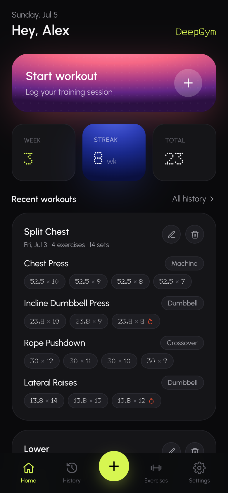
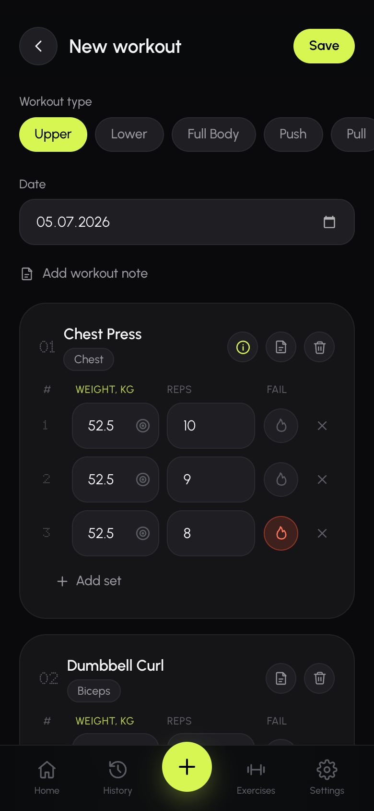
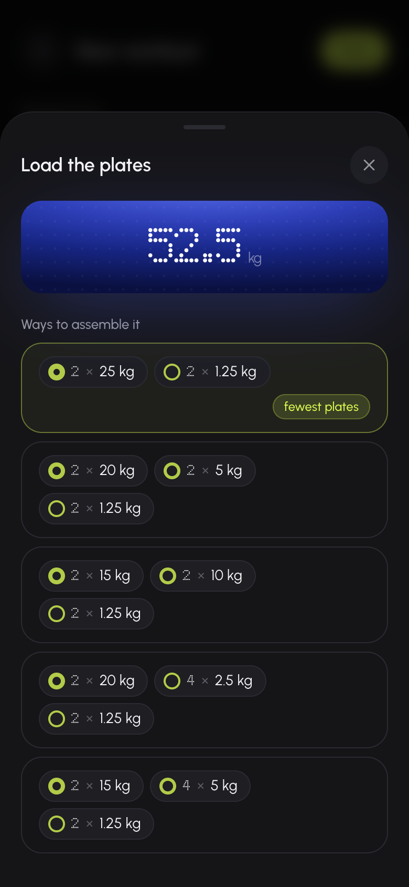
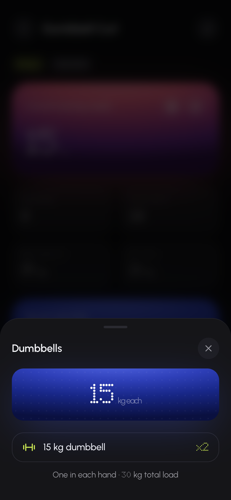
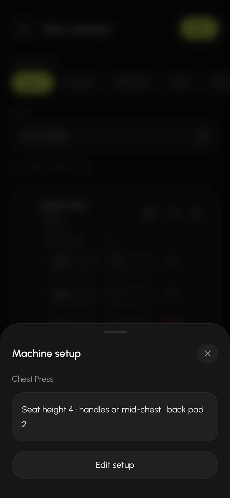
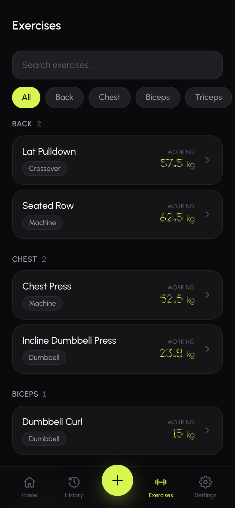
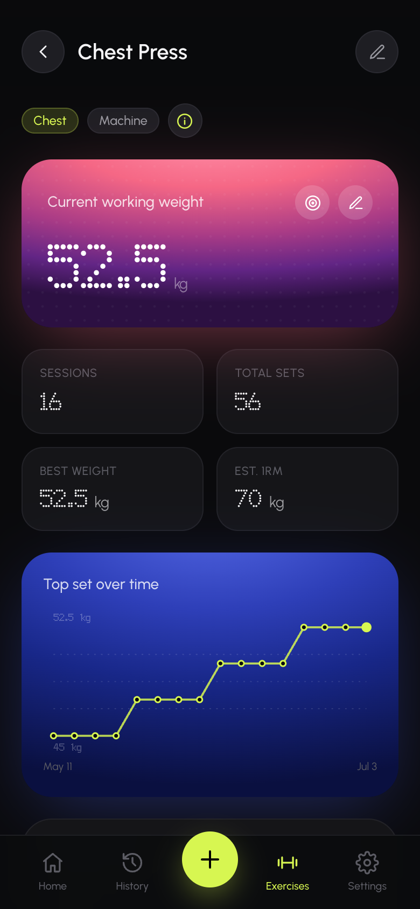
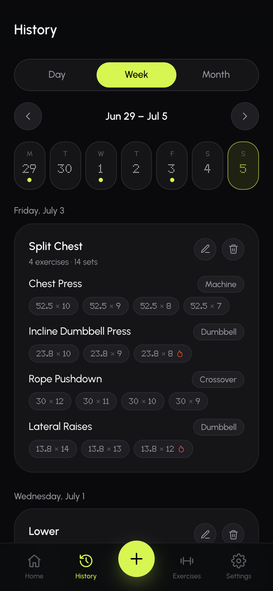
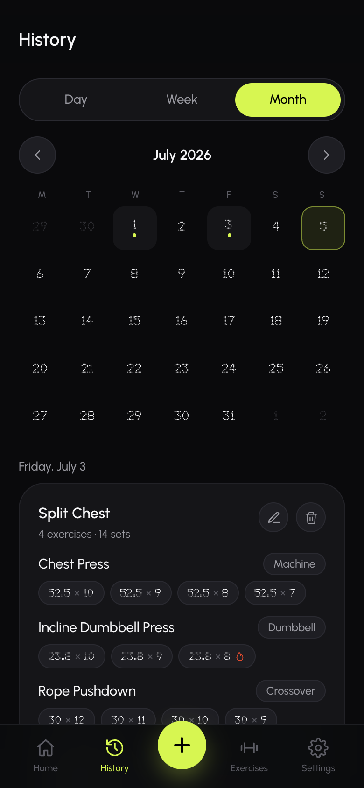
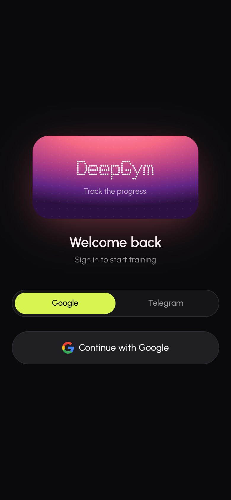

# DeepGym

**Your training log, finally done right.**

A fast, beautiful workout tracker that lives on your phone's home screen.
Log sets in seconds, never forget a machine setting again, and watch your
strength grow week after week.

---

## Why DeepGym?

You're mid-workout. Rest timer is ticking. The last thing you want is a
clunky app with 12 taps to log one set. DeepGym is built around one idea:
**capture your training with zero friction, and turn it into insight.**

- 📱 **Installs like a native app** — add it to your home screen, works offline, no app store needed.
- ⚡ **Fast logging** — the first set is created automatically, the next one copies the last, your working weight is pre-filled.
- 🧠 **Remembers what you can't** — machine seat heights, plate math, your numbers from three weeks ago.
- 📈 **Shows real progress** — charts and stats per exercise, not just a diary.

---

## The tour

### Home — everything at a glance

Your week, your streak, your recent sessions — and one big button to start
training.

### Log a workout in seconds

Pick a workout type (Upper, Lower, Full Body, Push, Pull or a Split for any
muscle group), today's date is already set. Add exercises from your personal
catalog — or create a new one right there. Every exercise starts with one
set ready to fill; **＋ Add set** copies the previous one so you only change
what changed. Mark a set with 🔥 when you hit failure.

Had a rough day? Attach a note to the whole workout or to a single
exercise — *"slept 4 hours, kept it light"* — and it stays in your history.

Your draft is **saved locally as you type**: close the app, switch songs,
come back — nothing is lost.

### Plate math, solved

Tap the ⊚ icon next to any weight and DeepGym shows **every reasonable way
to assemble it** from the plates your gym actually has — best option
(fewest plates) first:

- **Machine (plate-loaded):** `60 kg → 2 × 30 · 2 × 25 + 2 × 5 · 2 × 20 + 2 × 10 …`
- **Barbell:** the bar is subtracted automatically and the load is shown
  *per side* — `40 kg → bar + 1 × 10 per side, or 2 × 5, or 1 × 5 + 2 × 2.5…`
- **Dumbbells:** no fake plate math — `15 kg each, one in each hand, 30 kg total`
- **Crossover:** it's a cable stack, so no plate button at all — just type the weight

Your plate set is configurable in Settings, and each plate can be added in
**kg or lb** — mixed racks are fine.

### Never re-adjust a machine from memory

For machine exercises, save your setup once — seat height, pad position,
grip — and it's always one tap away behind the ⓘ button, right inside your
workout.

### Your exercise library

Exercises organized by muscle group — Back, Chest, Biceps, Triceps,
Shoulders, Legs, plus any group you add. Each shows its **current working
weight**, so you always know what to load.

Prefer pounds for a specific machine? Set a **per-exercise unit** (kg/lb) —
it overrides your default just for that exercise.

### Analytics that actually help

Open any exercise and see:

- **Working weight** — big, editable, with plate breakdown one tap away
- **Sessions, total sets, best weight, estimated 1RM**
- **Top-set progress chart** — your strength curve over time
- **Reps by weight** — average / median / most common reps at every weight
  you've used, so you know when it's time to move up

### History you can actually browse

Day, week or month view. Calendar dots show training days; open any day to
review, edit or delete a session.

### Sign in your way

Google — one tap. Or Telegram: the DeepGym bot sends you a one-time code,
no password to remember, ever.

---

## Install it on your phone

1. Open the app in your browser.
2. **iPhone:** Share → *Add to Home Screen*. **Android:** menu → *Install app*.
3. That's it — full-screen, offline-ready, with its own icon.

---

## Quick reference

| Feature | Where |
| --- | --- |
| Start a workout | Home → **Start workout**, or the ➕ tab button |
| Add a set / mark failure | **＋ Add set** / flame button on the set row |
| Plate breakdown | ⊚ icon next to any weight |
| Machine setup notes | ⓘ button on machine exercises |
| Change working weight | Exercise page → ✏️ on the pink card |
| kg ↔ lb (global) | Settings → Weight unit |
| kg ↔ lb (one exercise) | Exercise page → ✏️ → Weight unit |
| Your plates & bar | Settings → Plate calculator |
| Custom muscle groups | Settings → Muscle groups |
| Notes | "Add workout note" or the 📝 icon on any exercise |

---

## For developers

Want to self-host or hack on DeepGym? See **[SETUP.md](SETUP.md)** —
Supabase setup, Google OAuth, the Telegram bot, local development and
architecture notes (Next.js + TypeScript + Tailwind + Supabase,
Feature-Sliced Design).
