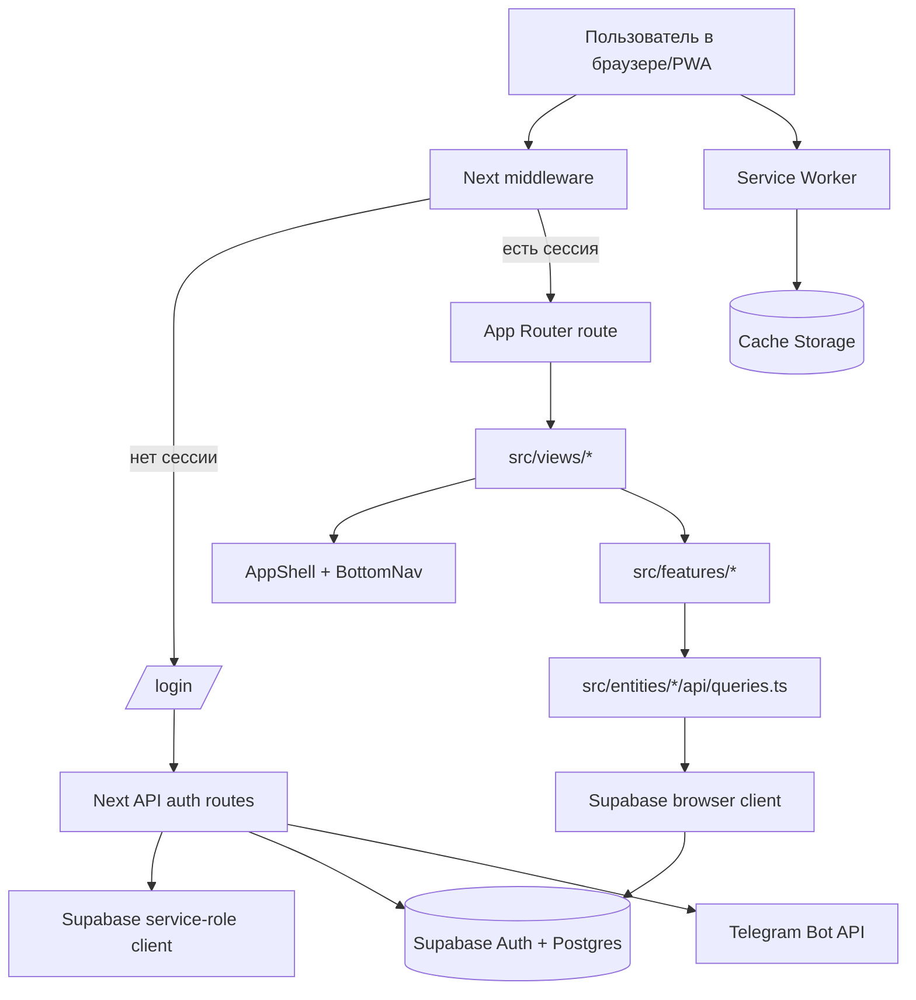
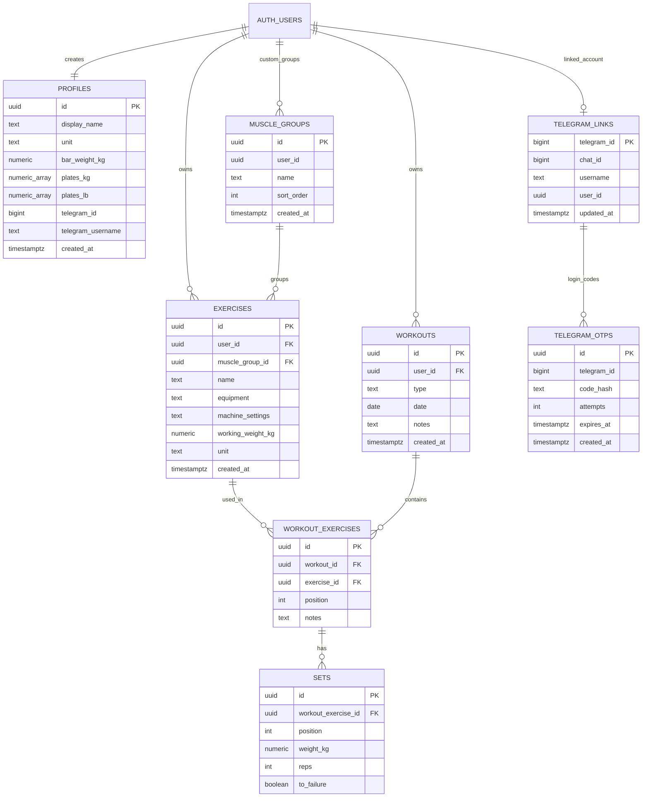
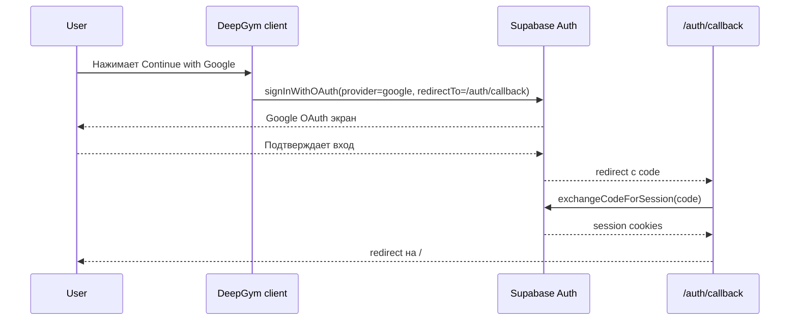
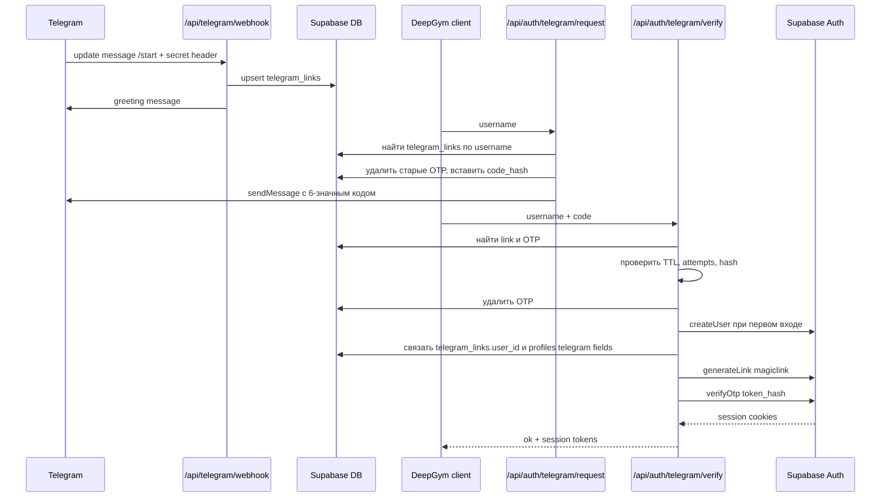
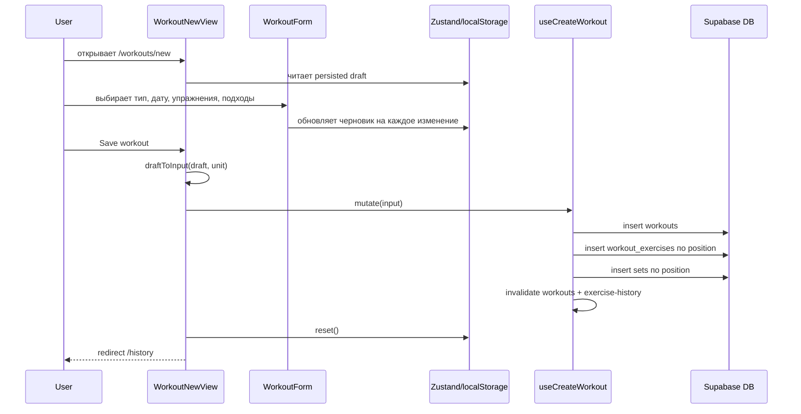
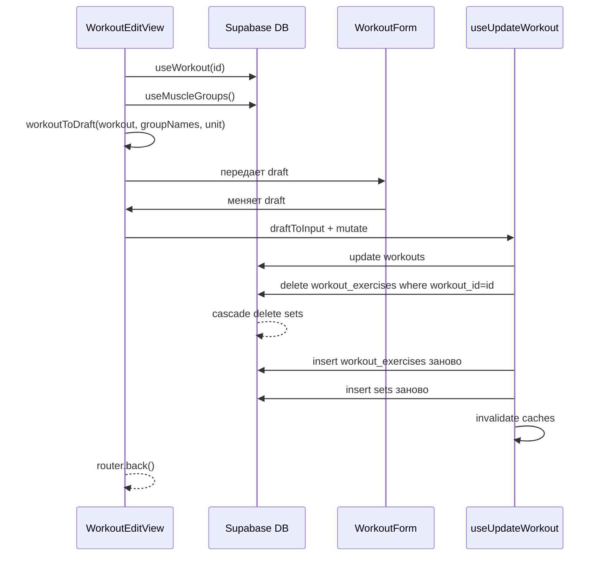

# DeepGym: подробная схема работы приложения

Этот документ описывает, как устроено приложение DeepGym: из каких слоев оно состоит, какие экраны есть, как ходят данные, как работает авторизация, где хранится состояние и что происходит при создании или редактировании тренировки.

## 1. Что это за приложение

DeepGym - мобильный PWA-трекер силовых тренировок.

Главная задача приложения:

- быстро записывать тренировку;
- хранить каталог упражнений пользователя;
- помнить рабочие веса, настройки тренажеров и блины/гриф;
- показывать историю и прогресс по упражнениям;
- работать как приложение на домашнем экране телефона;
- сохранять черновик новой тренировки локально, чтобы ввод не пропал.

Основной стек:

- Next.js 15 App Router;
- React 19;
- TypeScript;
- Tailwind CSS 4;
- Supabase Auth + Supabase Postgres;
- Row Level Security в Supabase;
- TanStack React Query для загрузки и кеширования серверных данных;
- Zustand persist для локального черновика тренировки;
- Service Worker + Web App Manifest для PWA.

## 2. Общая архитектура

Приложение разделено по Feature-Sliced Design.

```text
app/
  Next.js App Router: URL-роуты, layout, API routes, manifest

src/app/
  глобальные провайдеры, шрифты, стили

src/views/
  полноценные экраны приложения:
  home, login, history, exercises, exercise-detail,
  workout-new, workout-edit, settings

src/widgets/
  крупные сборные блоки интерфейса:
  app-shell, bottom-nav

src/features/
  пользовательские фичи:
  auth, workout-form, plate-calculator,
  machine-info, exercise-stats, exercise-compare

src/entities/
  предметные сущности и их запросы:
  user, muscle-group, exercise, workout

src/shared/
  переиспользуемые UI-компоненты, lib-функции,
  Supabase-клиенты, конфиги

supabase/migrations/
  SQL-схема базы данных, RLS-политики, дефолтные группы мышц

scripts/
  dev-утилиты: сид демо-данных, иконки, скриншоты,
  локальный Telegram polling
```

Главная идея:

- `app/` почти ничего не знает о бизнес-логике, он только подключает нужный `View`;
- `views/` собирают экран из фич, виджетов и entity-хуков;
- `features/` содержат сложную пользовательскую механику;
- `entities/` знают, как читать/писать конкретные таблицы Supabase;
- `shared/` хранит базовые кирпичики.

## 3. Высокоуровневый поток



## 4. Запуск приложения и глобальная обвязка

### `app/layout.tsx`

Корневой layout:

- подключает шрифты `Urbanist` и локальный `matricha.ttf`;
- подключает `src/app/globals.css`;
- оборачивает приложение в `Providers`;
- задает metadata, PWA manifest, Apple Web App настройки и viewport.

### `src/app/providers.tsx`

`Providers` делает две вещи:

- создает `QueryClient` для React Query;
- в production регистрирует service worker `/sw.js`;
- в development удаляет старые service workers и кеши `deepgym-*`, чтобы не ловить устаревшие чанки.

React Query настроен так:

- `staleTime: 30_000`;
- `retry: 1`;
- `refetchOnWindowFocus: false`.

### `middleware.ts`

Middleware выполняется перед защищенными страницами:

- публичные пути: `/login`, `/auth`, `/api`, `/offline`;
- если Supabase env не настроены, все приватные страницы редиректятся на `/login`;
- если пользователь не залогинен и путь не публичный, редирект на `/login`;
- если пользователь залогинен и идет на `/login`, редирект на `/`;
- middleware также помогает Supabase обновлять auth cookies.

## 5. Карта URL и экранов

| URL | Файл route | View | Назначение |
| --- | --- | --- | --- |
| `/` | `app/page.tsx` | `HomeView` | Главная: CTA, статистика недели, серия, последние тренировки |
| `/login` | `app/login/page.tsx` | `LoginView` | Вход через Google или Telegram OTP |
| `/history` | `app/history/page.tsx` | `HistoryView` | История тренировок: день, неделя, месяц |
| `/exercises` | `app/exercises/page.tsx` | `ExercisesView` | Каталог упражнений по группам мышц |
| `/exercises/[id]` | `app/exercises/[id]/page.tsx` | `ExerciseDetailView` | Детальная страница упражнения, аналитика, редактирование |
| `/workouts/new` | `app/workouts/new/page.tsx` | `WorkoutNewView` | Создание новой тренировки |
| `/workouts/[id]/edit` | `app/workouts/[id]/edit/page.tsx` | `WorkoutEditView` | Редактирование тренировки |
| `/settings` | `app/settings/page.tsx` | `SettingsView` | Профиль, единицы веса, блины, группы мышц, выход |
| `/offline` | `app/offline/page.tsx` | inline page | Offline fallback page |

API routes:

| URL | Назначение |
| --- | --- |
| `/auth/callback` | OAuth callback для Google PKCE |
| `/api/auth/telegram/request` | Запросить Telegram OTP-код |
| `/api/auth/telegram/verify` | Проверить Telegram OTP-код и создать Supabase-сессию |
| `/api/telegram/webhook` | Telegram webhook, который связывает telegram user -> chat_id |
| `/api/dev/login` | Dev-only passwordless login по email |

## 6. Навигация и оболочка

### `AppShell`

`src/widgets/app-shell/ui/app-shell.tsx`

Общий layout для экранов:

- ограничивает ширину до `max-w-md`;
- делает мобильную колонку на всю высоту;
- может показывать sticky header;
- умеет показывать back-кнопку;
- принимает правый action;
- добавляет нижнюю навигацию, если `hideNav` не включен.

### `BottomNav`

`src/widgets/app-shell/ui/bottom-nav.tsx`

Нижние вкладки:

- Home -> `/`;
- History -> `/history`;
- центральная кнопка Add -> `/workouts/new`;
- Exercises -> `/exercises`;
- Settings -> `/settings`.

Активность вкладки определяется по текущему pathname.

## 7. База данных

Схема находится в `supabase/migrations/0001_init.sql`.

### ER-схема



### Основные правила данных

Профиль:

- создается автоматически Supabase trigger-ом `handle_new_user`;
- хранит имя, глобальную единицу веса, вес грифа, список блинов в kg и lb;
- может хранить Telegram ID и username.

Группы мышц:

- дефолтные группы имеют `user_id = null`;
- пользователь может добавить свои группы с `user_id = auth.uid()`;
- дефолтные группы: Back, Chest, Biceps, Triceps, Shoulders, Legs.

Упражнения:

- всегда принадлежат конкретному пользователю;
- привязаны к muscle group;
- имеют тип оборудования:
  - `free_weight` - штанга;
  - `dumbbell` - гантели;
  - `machine` - тренажер с блинами;
  - `crossover` - блочный тренажер/стек;
- могут хранить `machine_settings`;
- могут иметь `working_weight_kg`;
- могут иметь override единицы веса `unit`, иначе используется `profile.unit`.

Тренировки:

- `workouts` - шапка тренировки: тип, дата, заметка;
- `workout_exercises` - упражнения внутри конкретной тренировки, с порядком и заметкой;
- `sets` - подходы внутри упражнения: вес, повторы, до отказа.

Telegram:

- `telegram_links` хранит Telegram ID, chat ID, username и связанный Supabase user;
- `telegram_otps` хранит только hash кода, не сам код;
- эти таблицы с RLS, но без публичных policies, доступ к ним идет через service-role на сервере.

### RLS

Все пользовательские таблицы защищены RLS:

- профиль доступен только владельцу;
- упражнения доступны только владельцу;
- тренировки доступны только владельцу;
- подходы доступны через проверку владельца родительской тренировки;
- группы мышц можно читать, если это дефолтная группа или своя группа;
- кастомные группы можно создавать/обновлять/удалять только свои.

## 8. Единицы веса

Ключевой invariant:

```text
В базе все веса хранятся в килограммах.
```

Это касается:

- `exercises.working_weight_kg`;
- `sets.weight_kg`;
- `profiles.bar_weight_kg`;
- внутреннего расчета блинов.

Отображение:

- если у упражнения есть `exercise.unit`, используется она;
- иначе используется `profile.unit`;
- при вводе вес конвертируется в kg перед сохранением;
- при чтении вес конвертируется из kg в нужную unit для UI.

Основные функции лежат в `src/shared/lib/weight.ts`:

- `kgToUnit`;
- `unitToKg`;
- `roundWeight`;
- `formatWeight`;
- `parseWeight`;
- `buildPlateSpecs`;
- `calcPlateVariants`;
- `calcPlatesGreedy`.

## 9. Supabase-клиенты

### Browser client

`src/shared/lib/supabase/client.ts`

Используется в React Query hooks на клиенте:

- один singleton `createBrowserClient`;
- читает `NEXT_PUBLIC_SUPABASE_URL`;
- читает `NEXT_PUBLIC_SUPABASE_ANON_KEY`;
- работает под текущей user session и подчиняется RLS.

### Server client

`src/shared/lib/supabase/server.ts`

Используется на сервере:

- OAuth callback;
- dev login;
- verify Telegram OTP;
- умеет читать/ставить cookies через Next `cookies()`.

### Admin client

`src/shared/lib/supabase/admin.ts`

Используется только на сервере:

- service-role key;
- bypass RLS;
- нужен для Telegram auth flow, webhook, dev utilities;
- нельзя отдавать на клиент.

## 10. Entity hooks

Entity hooks находятся в `src/entities/*/api/queries.ts`.

### User

`useProfile`

- берет текущего Supabase user;
- читает строку из `profiles`;
- возвращает `Profile | null`.

`useUpdateProfile`

- обновляет профиль текущего user;
- после успеха invalidates `["profile"]`.

### Muscle groups

`useMuscleGroups`

- читает все доступные группы;
- сортирует по `sort_order`, затем `name`;
- кеширует дольше: `staleTime: 5 * 60_000`.

`useCreateMuscleGroup`

- создает группу с `user_id = user.id`;
- invalidates `["muscle-groups"]`.

`useDeleteMuscleGroup`

- удаляет группу;
- удалить можно только свою и только если FK не мешает.

### Exercises

`useExercises`

- читает каталог упражнений пользователя;
- сортирует по имени.

`useExercise(id)`

- читает одно упражнение.

`useCreateExercise`

- создает упражнение с `user_id = user.id`;
- invalidates `["exercises"]`.

`useUpdateExercise`

- обновляет поля упражнения;
- invalidates `["exercises"]` и `["exercise", id]`.

`useDeleteExercise`

- удаляет упражнение;
- invalidates `["exercises"]` и `["workouts"]`;
- из-за FK cascade упражнение удаляется из workout_exercises, а их sets тоже удаляются каскадом.

### Workouts

`useWorkouts(from, to)`

- читает тренировки в диапазоне дат включительно;
- select подтягивает вложенные:
  - `workout_exercises`;
  - `exercise`;
  - `sets`;
- сортирует тренировки по дате и `created_at`;
- дополнительно сортирует вложенные упражнения и подходы по `position`.

`useWorkout(id)`

- читает одну тренировку с теми же вложенными данными.

`useCreateWorkout`

- создает строку `workouts`;
- последовательно создает `workout_exercises`;
- для каждого упражнения создает `sets`;
- invalidates `["workouts"]` и `["exercise-history"]`.

`useUpdateWorkout`

- обновляет шапку тренировки;
- удаляет все старые `workout_exercises` по `workout_id`;
- из-за cascade удаляются старые `sets`;
- заново вставляет вложенные упражнения и подходы;
- invalidates `["workouts"]`, `["workout", id]`, `["exercise-history"]`.

`useDeleteWorkout`

- удаляет тренировку;
- вложенные упражнения и подходы удаляются cascade;
- invalidates `["workouts"]` и `["exercise-history"]`.

### Exercise history

`useExerciseHistory(exerciseId)`

- читает все подходы конкретного упражнения через inner joins:
  - `sets`;
  - `workout_exercises`;
  - `workouts`;
- возвращает плоский список подходов с датой, типом тренировки, заметкой упражнения;
- сортирует от старых к новым.

## 11. Авторизация

В приложении есть три варианта входа:

- Google OAuth для пользователя;
- Telegram OTP для пользователя;
- dev-only login по email для локальной разработки.

### Google flow



Код:

- кнопка: `src/features/auth/ui/google-button.tsx`;
- callback: `app/auth/callback/route.ts`.

### Telegram OTP flow

Сначала пользователь должен открыть Telegram bot и нажать `/start`.



Правила OTP:

- код 6 цифр;
- TTL 5 минут;
- resend cooldown 60 секунд;
- максимум 5 попыток;
- в базе хранится hash через SHA-256;
- hash использует pepper из `TELEGRAM_WEBHOOK_SECRET`;
- старые коды удаляются при создании нового.

Код:

- форма: `src/features/auth/ui/telegram-otp-form.tsx`;
- отправить код: `app/api/auth/telegram/request/route.ts`;
- проверить код: `app/api/auth/telegram/verify/route.ts`;
- webhook: `app/api/telegram/webhook/route.ts`;
- отправка Telegram message: `src/shared/lib/telegram.ts`;
- hash OTP: `src/shared/lib/otp.ts`.

### Dev login

`GET /api/dev/login?email=demo@deepgym.app`

- работает только не в production;
- генерирует magiclink через service-role;
- серверно consume-ит token;
- редиректит на `/`.

## 12. Главный экран

`src/views/home/ui/home-view.tsx`

Что делает:

- читает профиль;
- читает тренировки за последние 180 дней;
- определяет текущую единицу веса;
- считает:
  - сколько тренировок на текущей неделе;
  - week streak;
  - total за 180 дней;
- показывает CTA `Start workout`;
- показывает 3 последние тренировки;
- позволяет перейти к редактированию или удалить тренировку.

Week streak считается по неделям с понедельника:

- если есть тренировка на текущей неделе, серия начинается с текущей недели;
- если текущая неделя пустая, серия может начаться с прошлой недели;
- дальше идут подряд недели с тренировками.

## 13. Создание тренировки

`src/views/workout-new/ui/workout-new-view.tsx`

Новая тренировка строится вокруг `WorkoutForm` и локального persisted draft.

### Локальный черновик

`src/features/workout-form/model/draft.ts`

Черновик хранится в Zustand persist:

```text
localStorage key: deepgym-workout-draft
```

Черновик нужен, чтобы во время тренировки пользователь мог:

- закрыть приложение;
- переключиться на музыку;
- вернуться позже;
- не потерять введенные веса/повторы.

Структура черновика:

- `type`;
- `date`;
- `notes`;
- `showNotes`;
- `exercises[]`;
- внутри каждого упражнения:
  - `exerciseId`;
  - `name`;
  - `muscleGroupName`;
  - `equipment`;
  - `machineSettings`;
  - effective `unit`;
  - notes;
  - sets;
- внутри set:
  - `weight` строкой в display unit;
  - `reps` строкой;
  - `toFailure`.

### Поток создания



### Преобразование перед сохранением

`draftToInput`:

- trim-ит тип тренировки;
- пустые notes превращает в `null`;
- парсит вес;
- переводит вес из display unit в kg;
- округляет kg до двух знаков;
- парсит reps;
- оставляет `to_failure`.

## 14. Форма тренировки

`src/features/workout-form/ui/workout-form.tsx`

Состав формы:

- выбор типа тренировки;
- дата;
- заметка к тренировке;
- список упражнений;
- для каждого упражнения:
  - название и группа;
  - кнопка настроек тренажера для `machine`;
  - кнопка сравнения с прошлым результатом;
  - заметка упражнения;
  - удаление упражнения;
  - список подходов;
  - вес;
  - повторы;
  - флаг `to failure`;
  - удаление подхода;
  - добавление подхода.

Типы тренировки:

- базовые: Upper, Lower, Full Body, Push, Pull;
- плюс `Split ${group.name}` для каждой группы мышц.

Добавление подхода:

- `newSet(prev)` копирует вес и reps из предыдущего подхода;
- `toFailure` всегда сбрасывается в `false`.

Кнопка блинов:

- показывается для всех equipment, кроме `crossover`;
- открывает `PlateSheet`;
- берет вес из текущего input;
- переводит в kg с учетом unit конкретного упражнения.

## 15. Выбор и создание упражнения

`src/features/workout-form/ui/exercise-picker.tsx`

Внутри bottom sheet можно:

- искать упражнение по имени;
- фильтровать по группе мышц;
- выбрать существующее упражнение;
- создать новое упражнение.

При создании упражнения указываются:

- name;
- muscle group;
- equipment;
- machine setup, если equipment = `machine`;
- unit override:
  - default;
  - kg;
  - lb;
- optional working weight.

После создания:

- упражнение создается в Supabase;
- оно сразу добавляется в текущую тренировку;
- первый set создается автоматически;
- weight prefill берется из `working_weight_kg`.

## 16. Редактирование тренировки

`src/views/workout-edit/ui/workout-edit-view.tsx`

Поток:



Важный нюанс:

- редактирование вложенных строк сделано простым надежным способом: удалить старые nested rows и вставить новые;
- поэтому ID у `workout_exercises` и `sets` после save меняются.

## 17. Калькулятор блинов

`src/features/plate-calculator/ui/plate-sheet.tsx`

Фича берет:

- текущий вес;
- equipment;
- display unit;
- профиль пользователя;
- `profile.bar_weight_kg`;
- `profile.plates_kg`;
- `profile.plates_lb`.

Типы поведения:

| Equipment | Поведение |
| --- | --- |
| `free_weight` | Это штанга: вес грифа вычитается, остаток делится на две стороны |
| `machine` | Это тренажер с блинами: общий вес делится на пары блинов |
| `dumbbell` | Блины не считаются: показывается вес одной гантели и общий load x2 |
| `crossover` | Кнопка блинов вообще не показывается |

Алгоритм:

- `buildPlateSpecs` объединяет kg и lb блины в общий список;
- все номиналы переводятся в kg для расчета;
- список сортируется от тяжелых к легким;
- `calcPlateVariants` DFS-ом ищет разумные симметричные комбинации;
- допускается небольшая погрешность для lb блинов;
- максимум 8 блинов на сторону;
- возвращается максимум 5 вариантов;
- сортировка: сперва точность, потом меньшее число блинов;
- если точного варианта нет, `calcPlatesGreedy` показывает ближайший greedy-вариант.

## 18. Настройки тренажера

`src/features/machine-info/ui/machine-info.tsx`

Для exercise с `equipment = machine` появляется кнопка info.

Она:

- открывает bottom sheet;
- показывает сохраненные `machine_settings`;
- позволяет редактировать текст;
- сохраняет через `useUpdateExercise`;
- обновляет кеш упражнения.

Используется:

- в форме тренировки;
- на странице упражнения.

## 19. Сравнение с прошлой тренировкой

`src/features/exercise-compare/ui/compare-button.tsx`

Кнопка сравнения открывает sheet:

- читает `useExerciseHistory(exerciseId)`;
- группирует подходы по дате;
- по умолчанию выбирает последнюю дату;
- показывает текущие введенные sets в этой тренировке;
- показывает sets за выбранный прошлый день;
- показывает календарь с отмеченными тренировочными днями;
- может показать заметку к упражнению из прошлой тренировки.

Это помогает во время тренировки видеть, какие веса и повторы были раньше.

## 20. Каталог упражнений

`src/views/exercises/ui/exercises-view.tsx`

Экран делает:

- читает группы мышц;
- читает упражнения;
- читает профиль для unit;
- дает поиск по имени;
- дает фильтр по группе;
- группирует упражнения по muscle group;
- показывает working weight каждого упражнения;
- ведет на `/exercises/[id]`.

Если у упражнения есть unit override, working weight показывается в unit упражнения.

## 21. Детальная страница упражнения

`src/views/exercise-detail/ui/exercise-detail-view.tsx`

Экран читает:

- упражнение;
- группы мышц;
- профиль;
- историю подходов упражнения.

Показывает:

- tags: muscle group, equipment, unit override;
- кнопку machine info для тренажеров;
- текущий working weight;
- кнопку расчета блинов;
- кнопку редактирования working weight;
- summary tiles;
- график прогресса;
- таблицу reps by weight;
- recent history;
- edit exercise sheet;
- delete exercise confirmation.

### Статистика упражнения

`src/features/exercise-stats/model/stats.ts`

`exerciseSummary` считает:

- количество сессий;
- total sets;
- total reps;
- best weight;
- estimated 1RM;
- last date.

Estimated 1RM считается формулой Epley:

```text
1RM = weight * (1 + reps / 30)
```

`progressSeries`:

- группирует по дате тренировки;
- берет максимальный вес за дату;
- возвращает точки для line chart.

`repStatsByWeight`:

- группирует подходы по весу;
- считает:
  - set count;
  - average reps;
  - median reps;
  - mode reps;
  - failure rate.

`ProgressChart`:

- минимальный SVG-график;
- показывает dotted guides;
- подписывает min/max и даты.

## 22. История тренировок

`src/views/history/ui/history-view.tsx`

Режимы:

- day;
- week;
- month.

Для каждого режима считается range:

- day: selected day;
- week: Monday-Sunday;
- month: start/end of month.

Экран:

- читает тренировки в диапазоне;
- дает переключатель day/week/month;
- дает стрелки previous/next;
- заголовок периода кликается и сбрасывает дату на сегодня;
- в week показывает `WeekStrip`;
- в month показывает `MonthGrid`;
- список тренировок в week/month группируется по дате;
- тренировки можно редактировать и удалять.

Month/week grids показывают точки по дням, где есть тренировки.

## 23. Настройки

`src/views/settings/ui/settings-view.tsx`

Экран настроек содержит:

- display name;
- Telegram username, если связан;
- глобальную единицу веса kg/lb;
- вес грифа;
- список доступных блинов;
- добавление блина в kg или lb;
- удаление блина;
- список muscle groups;
- добавление кастомной группы;
- удаление кастомной группы;
- sign out.

Блины хранятся как два массива:

- `profiles.plates_kg`;
- `profiles.plates_lb`.

При отображении они объединяются в один список и сортируются по реальному весу в kg.

## 24. PWA и offline

### Manifest

`app/manifest.ts`

Задает:

- name/short_name;
- start_url `/`;
- display `standalone`;
- colors;
- portrait orientation;
- icons.

### Service Worker

`public/sw.js`

Кеши:

- `deepgym-v1-static`;
- `deepgym-v1-pages`.

Правила:

- API, auth и cross-origin traffic не перехватываются;
- hashed Next static assets, icons, fonts кешируются cache-first;
- page navigations работают network-first;
- при offline fallback:
  - сперва cached page;
  - затем `/offline`.

Важно:

- сохранение тренировки в Supabase требует сети;
- но черновик новой тренировки хранится локально через Zustand persist;
- поэтому ввод не пропадает, но полноценной очереди offline-sync нет.

## 25. UI-система

Глобальные стили: `src/app/globals.css`.

Визуальный стиль:

- темный фон;
- max-width mobile layout;
- яркий lime accent;
- pink/indigo/flame gradient cards;
- custom dot font для чисел;
- rounded cards/sheets/chips;
- bottom sheets вместо обычных desktop modal dialogs.

Основные UI-компоненты:

- `Button`;
- `Input`;
- `TextArea`;
- `Field`;
- `Sheet`;
- `ConfirmSheet`;
- `Card`;
- `Calendar`;
- `Segmented`;
- `Chip`;
- `Toggle`;
- `DotValue`;
- `EmptyState`;
- `PageLoader`;
- `ErrorNote`;
- `Tag`;
- набор SVG icons.

## 26. Состояние приложения

Есть несколько типов состояния:

### Auth session

Supabase Auth session хранится Supabase SSR/client механизмом:

- cookies для SSR/middleware;
- browser session для client SDK.

### Server state

React Query:

- profile;
- muscle groups;
- exercises;
- workouts;
- exercise history.

После мутаций соответствующие query invalidates.

### Local UI state

`useState` внутри экранов и фич:

- открытие sheet;
- выбранные фильтры;
- выбранная дата;
- mode day/week/month;
- поля форм;
- confirm delete.

### Persisted local draft

Zustand persist:

- только новая тренировка;
- key `deepgym-workout-draft`;
- хранится в localStorage;
- сбрасывается после успешного save или discard.

## 27. Основные пользовательские сценарии

### Сценарий: первая настройка

```text
1. Пользователь входит через Google или Telegram.
2. Supabase trigger создает profile.
3. Пользователь идет в Settings.
4. Выбирает kg/lb.
5. Проверяет bar weight.
6. Добавляет блины, если нужно.
7. Добавляет кастомные группы мышц, если нужно.
```

### Сценарий: новая тренировка

```text
1. Home -> Start workout или BottomNav Add.
2. Открывается /workouts/new.
3. Тип по умолчанию Full Body, дата сегодня.
4. Пользователь нажимает Add exercise.
5. Выбирает существующее упражнение или создает новое.
6. Первый set создается автоматически.
7. Вес подтягивается из working weight, если он есть.
8. Пользователь вводит reps, добавляет подходы.
9. Add set копирует предыдущий вес и reps.
10. По необходимости отмечает failure.
11. По необходимости открывает plates, machine info или compare.
12. Save workout.
13. Все веса переводятся в kg.
14. Данные пишутся в workouts -> workout_exercises -> sets.
15. Черновик очищается.
16. Пользователь попадает в History.
```

### Сценарий: анализ упражнения

```text
1. Exercises -> выбирает упражнение.
2. Открывается /exercises/[id].
3. Приложение читает все sets этого упражнения.
4. Строит summary.
5. Строит top-set progress.
6. Группирует reps by weight.
7. Показывает последние тренировки по этому упражнению.
8. Пользователь может обновить working weight или настройки упражнения.
```

### Сценарий: Telegram вход

```text
1. Пользователь пишет /start боту.
2. Webhook или local polling сохраняет telegram_links.
3. В приложении пользователь вводит username.
4. Сервер генерирует OTP.
5. OTP отправляется в Telegram.
6. Пользователь вводит код.
7. Сервер проверяет hash, TTL и attempts.
8. Если user еще нет, создает Supabase auth user.
9. Создает session через magiclink verifyOtp.
10. Клиент уходит на /.
```

## 28. Dev scripts

`package.json`:

- `npm run dev` - Next dev server;
- `npm run build` - production build;
- `npm run start` - production server;
- `npm run lint` - ESLint;
- `npm run typecheck` - TypeScript check;
- `npm run icons` - генерация PWA icons.

`scripts/seed-demo.mjs`:

- создает/находит `demo@deepgym.app`;
- удаляет его старые workouts/exercises;
- создает каталог упражнений;
- генерирует примерно 8 недель тренировок;
- используется для скриншотов и локального теста.

`scripts/telegram-dev-poll.mjs`:

- локальная замена Telegram webhook;
- long-polling через `getUpdates`;
- upsert в `telegram_links`;
- отправка greeting на `/start`.

`scripts/take-screenshots.mjs`:

- переснимает скриншоты README.

`scripts/generate-icons.mjs`:

- генерирует PWA icons.

## 29. Env-переменные

`.env.example`:

```text
NEXT_PUBLIC_SUPABASE_URL
NEXT_PUBLIC_SUPABASE_ANON_KEY
SUPABASE_SERVICE_ROLE_KEY

TELEGRAM_BOT_TOKEN
NEXT_PUBLIC_TELEGRAM_BOT_USERNAME
TELEGRAM_WEBHOOK_SECRET

NEXT_PUBLIC_SITE_URL
```

Разделение:

- `NEXT_PUBLIC_*` можно использовать на клиенте;
- `SUPABASE_SERVICE_ROLE_KEY`, `TELEGRAM_BOT_TOKEN`, `TELEGRAM_WEBHOOK_SECRET` только на сервере.

## 30. Важные нюансы и ограничения

1. Все веса в базе в kg.
2. Unit override упражнения сильнее, чем unit профиля.
3. `crossover` не показывает калькулятор блинов.
4. `dumbbell` показывает вес одной гантели и общий load x2, но не считает блины.
5. Новая тренировка имеет persisted draft, редактирование существующей тренировки - нет.
6. Offline режим кеширует страницы и ассеты, но не синхронизирует новые сохранения в фоне.
7. Workouts пишутся напрямую из browser Supabase client под RLS, отдельного API для CRUD тренировок нет.
8. Telegram auth использует server API routes и service-role.
9. При update workout вложенные строки удаляются и вставляются заново.
10. Удаление exercise каскадно удаляет его usage в историях тренировок.
11. Дефолтные muscle groups нельзя удалить через UI, потому что у них `user_id = null`.
12. Telegram OTP хранится только как hash.
13. Dev login полностью отключен в production.
14. Service worker регистрируется только в production; в dev старый SW удаляется.

## 31. Где искать конкретную логику

| Что нужно понять | Файлы |
| --- | --- |
| Защита роутов и auth redirect | `middleware.ts` |
| Root layout, metadata, PWA settings | `app/layout.tsx`, `app/manifest.ts` |
| React Query provider и service worker registration | `src/app/providers.tsx` |
| Главная | `src/views/home/ui/home-view.tsx` |
| История | `src/views/history/ui/history-view.tsx` |
| Каталог упражнений | `src/views/exercises/ui/exercises-view.tsx` |
| Детали упражнения | `src/views/exercise-detail/ui/exercise-detail-view.tsx` |
| Новая тренировка | `src/views/workout-new/ui/workout-new-view.tsx` |
| Редактирование тренировки | `src/views/workout-edit/ui/workout-edit-view.tsx` |
| Форма тренировки | `src/features/workout-form/ui/workout-form.tsx` |
| Черновик тренировки | `src/features/workout-form/model/draft.ts` |
| Выбор/создание упражнения | `src/features/workout-form/ui/exercise-picker.tsx` |
| Калькулятор блинов | `src/features/plate-calculator/ui/plate-sheet.tsx`, `src/shared/lib/weight.ts` |
| Настройки тренажера | `src/features/machine-info/ui/machine-info.tsx` |
| Сравнение с прошлым результатом | `src/features/exercise-compare/ui/compare-button.tsx` |
| Статистика упражнения | `src/features/exercise-stats/model/stats.ts` |
| Google/Telegram login UI | `src/features/auth/ui/*` |
| Supabase CRUD hooks | `src/entities/*/api/queries.ts` |
| Типы предметных сущностей | `src/entities/*/model/types.ts` |
| База и RLS | `supabase/migrations/0001_init.sql` |
| PWA offline cache | `public/sw.js` |

## 32. Короткая ментальная модель

```text
DeepGym = Next.js PWA shell
  + Supabase Auth session
  + Supabase Postgres под RLS
  + React Query для всех server reads/writes
  + Zustand localStorage draft для новой тренировки
  + Feature modules вокруг gym-specific UX:
      workout form
      exercise picker
      plates calculator
      machine settings
      exercise history compare
      exercise stats
```

Если нужно быстро понять любую часть приложения, лучше идти так:

```text
URL в app/
  -> соответствующий src/views/*
  -> подключенные features/widgets
  -> entity hooks
  -> Supabase table в migration
```

