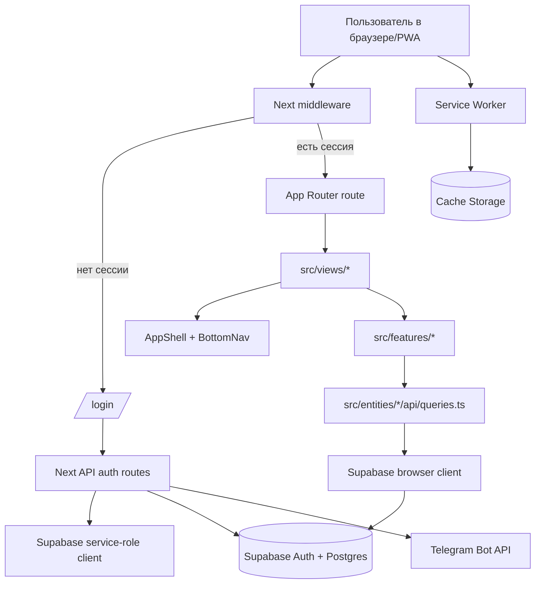
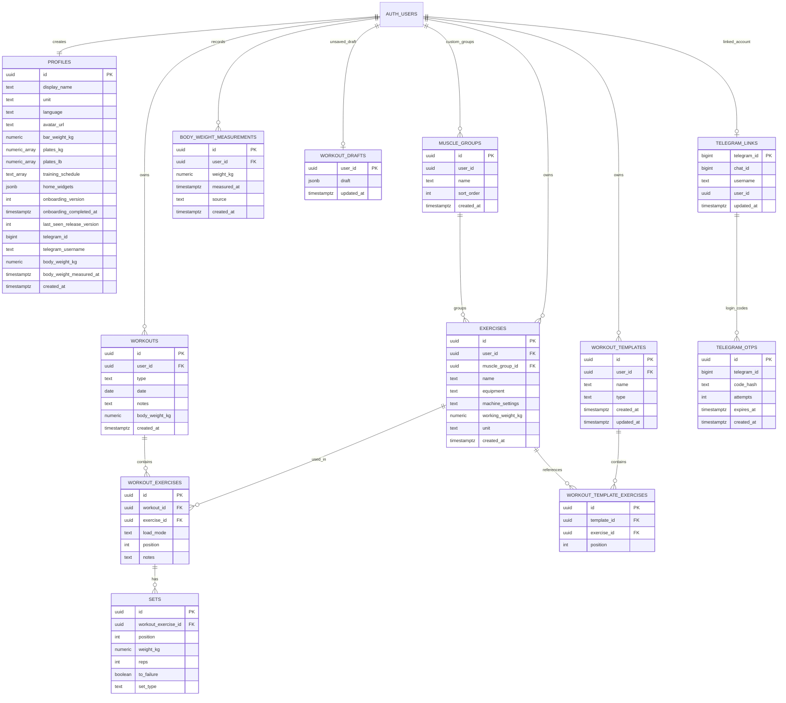
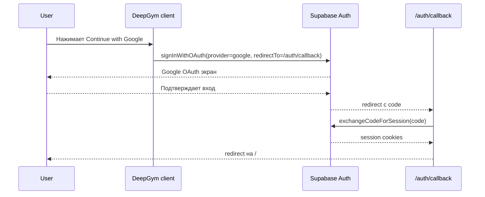
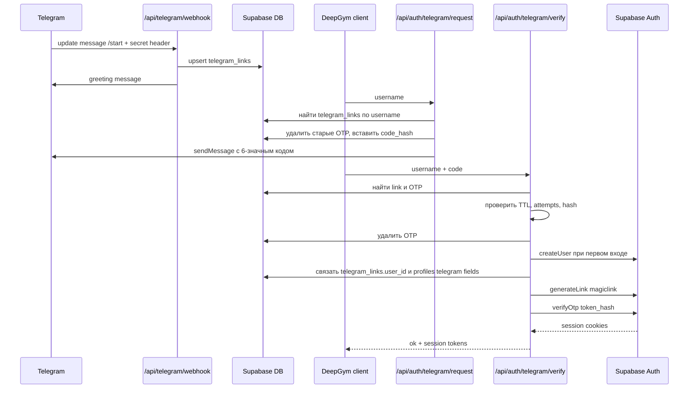
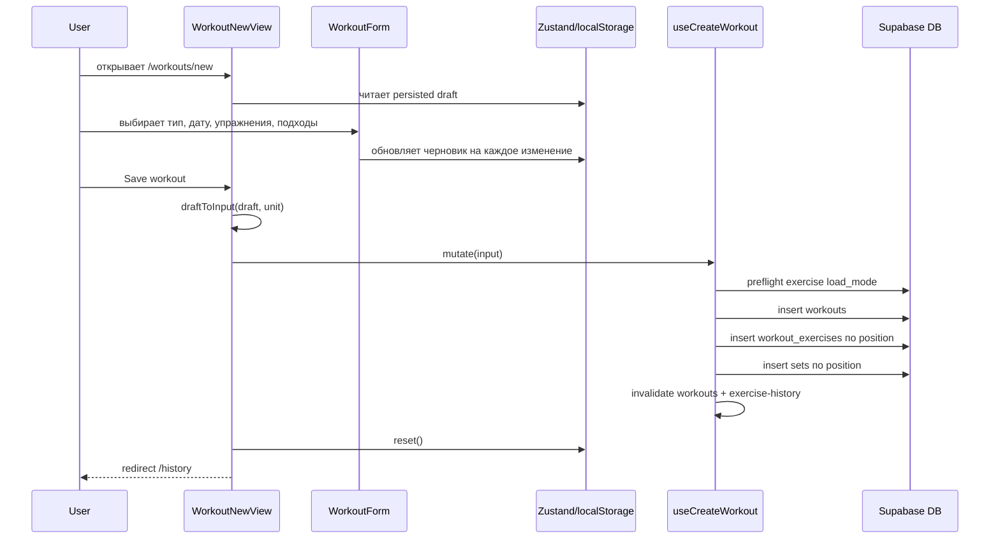
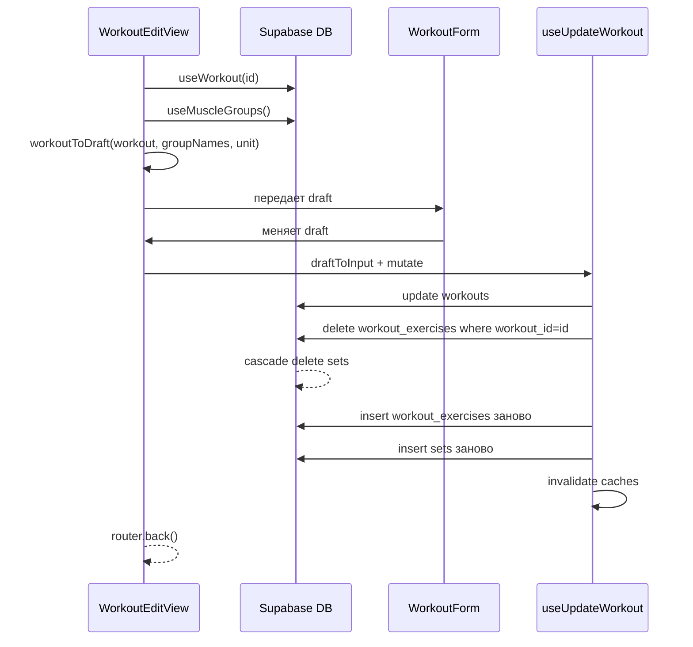

# DeepGym: подробная схема работы приложения

Этот документ описывает, как устроено приложение DeepGym: из каких слоев оно состоит, какие экраны есть, как ходят данные, как работает авторизация, где хранится состояние и что происходит при создании или редактировании тренировки.

## 1. Что это за приложение

DeepGym - мобильный PWA-трекер силовых тренировок.

Главная задача приложения:

- быстро записывать тренировку;
- хранить каталог упражнений пользователя;
- помнить рабочие веса, настройки тренажеров и блины/гриф;
- показывать историю и прогресс по упражнениям;
- работать как приложение на домашнем экране телефона;
- сохранять черновик новой тренировки локально и в облаке, чтобы ввод не пропал и продолжался с любого устройства;
- хранить переиспользуемые шаблоны тренировок;
- вести историю собственного веса и корректно считать добавленную/ассистирующую нагрузку в упражнениях с собственным весом;
- провести нового пользователя через обязательные настройки до первой тренировки;
- один раз показать переведенное описание каждой новой версии продукта.

Основной стек:

- Next.js 15 App Router;
- React 19;
- TypeScript;
- SCSS-модули (co-located `*.module.scss` рядом с компонентами);
- Supabase Auth + Supabase Postgres;
- Row Level Security в Supabase;
- TanStack React Query для загрузки и кеширования серверных данных;
- Zustand persist для локального черновика тренировки (плюс облачная копия в таблице `workout_drafts`);
- Service Worker + Web App Manifest для PWA.

## 2. Общая архитектура

Приложение разделено по Feature-Sliced Design.

```text
app/
  Next.js App Router: URL-роуты, layout, API routes, manifest

src/app/
  глобальные провайдеры, шрифты, стили

src/views/
  полноценные экраны приложения:
  home, login, onboarding, history, progress, exercises,
  exercise-detail, templates, template-detail, template-editor,
  workout-new, workout-edit, settings

src/widgets/
  крупные сборные блоки интерфейса:
  app-shell (+ bottom-nav, library-tabs), home-dashboard,
  product-experience

src/features/
  пользовательские фичи:
  auth, avatar, first-workout, what's-new, workout-form, workout-share,
  training-schedule, next-workout, plate-calculator,
  machine-info, exercise-stats, exercise-compare, body-weight,
  training-analytics

src/entities/
  предметные сущности и их запросы:
  user, muscle-group, exercise, workout, workout-template, body-weight

src/shared/
  переиспользуемые UI-компоненты, lib-функции,
  Supabase-клиенты, конфиги

supabase/migrations/
  SQL-схема базы данных, RLS-политики, дефолтные группы мышц

scripts/
  dev-утилиты: сид демо-данных, иконки, скриншоты,
  локальный Telegram polling
```

Главная идея:

- `app/` почти ничего не знает о бизнес-логике, он только подключает нужный `View`;
- `views/` собирают экран из фич, виджетов и entity-хуков;
- `features/` содержат сложную пользовательскую механику;
- `entities/` знают, как читать/писать конкретные таблицы Supabase;
- `shared/` хранит базовые кирпичики.

## 3. Высокоуровневый поток


```mermaid
flowchart TD
  User[Пользователь в браузере/PWA] --> MW[Next middleware]
  MW -->|нет сессии| Login[/login/]
  MW -->|есть сессия| Route[App Router route]
  Route --> View[src/views/*]
  View --> Shell[AppShell + BottomNav]
  View --> Feature[src/features/*]
  Feature --> EntityHooks[src/entities/*/api/queries.ts]
  EntityHooks --> ClientSupabase[Supabase browser client]
  ClientSupabase --> Supabase[(Supabase Auth + Postgres)]

  Login --> AuthApi[Next API auth routes]
  AuthApi --> AdminSupabase[Supabase service-role client]
  AuthApi --> Supabase
  AuthApi --> Telegram[Telegram Bot API]

  User --> SW[Service Worker]
  SW --> Cache[(Cache Storage)]
```

## 4. Запуск приложения и глобальная обвязка

### `app/layout.tsx`

Корневой layout:

- подключает шрифты `Urbanist` и локальный `matricha.ttf`;
- подключает `src/app/globals.css`;
- оборачивает приложение в `Providers`;
- задает metadata, PWA manifest, Apple Web App настройки и viewport.

### `src/app/providers.tsx`

`Providers`:

- создает `QueryClient` для React Query;
- синхронизирует язык интерфейса с профилем;
- оборачивает приватный интерфейс в глобальный `ProductExperience`;
- в production регистрирует service worker `/sw.js`;
- в development удаляет старые service workers и кеши `deepgym-*`, чтобы не ловить устаревшие чанки.

React Query настроен так:

- `staleTime: 30_000`;
- `retry: 1`;
- `refetchOnWindowFocus: false`.

### `middleware.ts`

Middleware выполняется перед защищенными страницами:

- публичные пути: `/login`, `/auth`, `/api`, `/offline`;
- если Supabase env не настроены, все приватные страницы редиректятся на `/login`;
- если пользователь не залогинен и путь не публичный, редирект на `/login`;
- если пользователь залогинен и идет на `/login`, редирект на `/`;
- middleware также помогает Supabase обновлять auth cookies.

## 5. Карта URL и экранов

| URL | Файл route | View | Назначение |
| --- | --- | --- | --- |
| `/` | `app/page.tsx` | `HomeView` | Главная: настраиваемая сетка виджетов (`HomeDashboard`) |
| `/login` | `app/login/page.tsx` | `LoginView` | Вход через Google или Telegram OTP |
| `/onboarding` | `app/onboarding/page.tsx` | `OnboardingView` | Пятишаговая первоначальная настройка; требует авторизации |
| `/history` | `app/history/page.tsx` | `HistoryView` | История тренировок: день, неделя, месяц |
| `/progress` | `app/progress/page.tsx` | `ProgressView` | Прогресс за период: итоги, активность, упражнения, рекорды, группы мышц, вес тела |
| `/exercises` | `app/exercises/page.tsx` | `ExercisesView` | Библиотека → упражнения по группам мышц |
| `/exercises/[id]` | `app/exercises/[id]/page.tsx` | `ExerciseDetailView` | Детальная страница упражнения, аналитика, редактирование |
| `/templates` | `app/templates/page.tsx` | `TemplatesView` | Библиотека → шаблоны тренировок с быстрым стартом |
| `/templates/new` | `app/templates/new/page.tsx` | `TemplateEditorView` | Создание шаблона |
| `/templates/[id]` | `app/templates/[id]/page.tsx` | `TemplateDetailView` | Просмотр шаблона и запуск тренировки |
| `/templates/[id]/edit` | `app/templates/[id]/edit/page.tsx` | `TemplateEditorView` | Редактирование шаблона |
| `/workouts/new` | `app/workouts/new/page.tsx` | `WorkoutNewView` | Создание новой тренировки |
| `/workouts/[id]/edit` | `app/workouts/[id]/edit/page.tsx` | `WorkoutEditView` | Редактирование тренировки |
| `/settings` | `app/settings/page.tsx` | `SettingsView` | Сгруппированный список: профиль, вес тела, неделя, блины, группы мышц, язык, единицы, главный экран, гайд, What's new, выход. `?open=<section>` открывает нужный sheet |
| `/offline` | `app/offline/page.tsx` | inline page | Offline fallback page |

API routes:

| URL | Назначение |
| --- | --- |
| `/auth/callback` | OAuth callback для Google PKCE |
| `/api/auth/telegram/request` | Запросить Telegram OTP-код |
| `/api/auth/telegram/verify` | Проверить Telegram OTP-код и создать Supabase-сессию |
| `/api/telegram/webhook` | Telegram webhook, который связывает telegram user -> chat_id |
| `/api/dev/login` | Dev-only passwordless login по email |

## 6. Навигация и оболочка

### `AppShell`

`src/widgets/app-shell/ui/app-shell.tsx`

Общий layout для экранов:

- ограничивает ширину до `max-w-md`;
- делает мобильную колонку на всю высоту;
- может показывать sticky header;
- умеет показывать back-кнопку;
- принимает правый action;
- `account` показывает аватар-ссылку на Settings (на вкладках History,
  Progress, Library; на Home аватар стоит в приветствии);
- `subheader` закрепляет под заголовком доп. контролы (переключатель
  периода на Progress, `LibraryTabs` в библиотеке);
- добавляет нижнюю навигацию, если `hideNav` не включен.

### `BottomNav`

`src/widgets/app-shell/ui/bottom-nav.tsx`

Нижние вкладки (центральная кнопка всегда посередине):

- Home -> `/`;
- History -> `/history`;
- центральная кнопка Add -> `/workouts/new`;
- Progress -> `/progress`;
- Library -> `/exercises` (активна и на `/templates*`).

Settings больше не вкладка — вход через аватар. Активность вкладки
определяется по pathname. Если есть незавершенный черновик тренировки
(`useActiveWorkoutDraft`: локальный или облачный, last-write-wins), кнопка
Add «дышит» и получает красную точку.

### `LibraryTabs`

`src/widgets/app-shell/ui/library-tabs.tsx` — сегмент Exercises ⇄ Templates
вверху библиотеки. Ссылки делают `replace`, поэтому переключение не
засоряет историю и назад всегда уводит из библиотеки.

## 7. База данных

Схема находится в `supabase/migrations/0001_init.sql`–`0008_home_widgets_warmup_sets.sql`.
Миграция 0008 добавляет `profiles.home_widgets` (раскладка главной) и
`sets.set_type` (`working` / `warmup`).
Миграции выполняются вручную в Supabase SQL Editor строго по номеру. Локальный
`.env.local` подключен к production-проекту, поэтому для QA можно изменять
только `demo@deepgym.app`.

### ER-схема


```mermaid
erDiagram
  AUTH_USERS ||--|| PROFILES : creates
  AUTH_USERS ||--o{ EXERCISES : owns
  AUTH_USERS ||--o{ WORKOUTS : owns
  AUTH_USERS ||--o{ MUSCLE_GROUPS : custom_groups
  AUTH_USERS ||--o{ BODY_WEIGHT_MEASUREMENTS : records
  AUTH_USERS ||--o{ WORKOUT_TEMPLATES : owns

  MUSCLE_GROUPS ||--o{ EXERCISES : groups
  EXERCISES ||--o{ WORKOUT_EXERCISES : used_in
  WORKOUTS ||--o{ WORKOUT_EXERCISES : contains
  WORKOUT_EXERCISES ||--o{ SETS : has
  WORKOUT_TEMPLATES ||--o{ WORKOUT_TEMPLATE_EXERCISES : contains
  EXERCISES ||--o{ WORKOUT_TEMPLATE_EXERCISES : references

  AUTH_USERS ||--o| WORKOUT_DRAFTS : unsaved_draft

  AUTH_USERS ||--o| TELEGRAM_LINKS : linked_account
  TELEGRAM_LINKS ||--o{ TELEGRAM_OTPS : login_codes

  PROFILES {
    uuid id PK
    text display_name
    text unit
    text language
    text avatar_url
    numeric bar_weight_kg
    numeric_array plates_kg
    numeric_array plates_lb
    text_array training_schedule
    jsonb home_widgets
    int onboarding_version
    timestamptz onboarding_completed_at
    int last_seen_release_version
    bigint telegram_id
    text telegram_username
    numeric body_weight_kg
    timestamptz body_weight_measured_at
    timestamptz created_at
  }

  MUSCLE_GROUPS {
    uuid id PK
    uuid user_id
    text name
    int sort_order
    timestamptz created_at
  }

  EXERCISES {
    uuid id PK
    uuid user_id FK
    uuid muscle_group_id FK
    text name
    text equipment
    text machine_settings
    numeric working_weight_kg
    text unit
    timestamptz created_at
  }

  WORKOUTS {
    uuid id PK
    uuid user_id FK
    text type
    date date
    text notes
    numeric body_weight_kg
    timestamptz created_at
  }

  WORKOUT_EXERCISES {
    uuid id PK
    uuid workout_id FK
    uuid exercise_id FK
    text load_mode
    int position
    text notes
  }

  SETS {
    uuid id PK
    uuid workout_exercise_id FK
    int position
    numeric weight_kg
    int reps
    boolean to_failure
    text set_type
  }

  WORKOUT_DRAFTS {
    uuid user_id PK
    jsonb draft
    timestamptz updated_at
  }

  BODY_WEIGHT_MEASUREMENTS {
    uuid id PK
    uuid user_id FK
    numeric weight_kg
    timestamptz measured_at
    text source
    timestamptz created_at
  }

  WORKOUT_TEMPLATES {
    uuid id PK
    uuid user_id FK
    text name
    text type
    timestamptz created_at
    timestamptz updated_at
  }

  WORKOUT_TEMPLATE_EXERCISES {
    uuid id PK
    uuid template_id FK
    uuid exercise_id FK
    int position
  }

  TELEGRAM_LINKS {
    bigint telegram_id PK
    bigint chat_id
    text username
    uuid user_id
    timestamptz updated_at
  }

  TELEGRAM_OTPS {
    uuid id PK
    bigint telegram_id
    text code_hash
    int attempts
    timestamptz expires_at
    timestamptz created_at
  }
```

### Основные правила данных

Профиль:

- создается автоматически Supabase trigger-ом `handle_new_user`;
- хранит имя, глобальную единицу веса, вес грифа, список блинов в kg и lb;
- хранит язык интерфейса и URL пользовательского/встроенного аватара;
- хранит явную тренировочную неделю: массив Monday–Sunday, где `null` — день отдыха; весь массив `null`, пока пользователь не настроил расписание;
- хранит завершенную версию onboarding, время завершения и последовательность последнего просмотренного продуктового релиза;
- кеширует последнее измерение собственного веса и его время; источником истории остается `body_weight_measurements`;
- может хранить Telegram ID и username.

Группы мышц:

- дефолтные группы имеют `user_id = null`;
- пользователь может добавить свои группы с `user_id = auth.uid()`;
- дефолтные группы: Back, Chest, Biceps, Triceps, Shoulders, Legs.

Упражнения:

- всегда принадлежат конкретному пользователю;
- привязаны к muscle group;
- имеют тип оборудования:
  - `free_weight` - штанга;
  - `dumbbell` - гантели;
  - `machine` - тренажер с блинами;
  - `crossover` - блочный тренажер/стек;
  - `bodyweight` - упражнение с собственным весом;
- могут хранить `machine_settings`;
- могут иметь `working_weight_kg`;
- могут иметь override единицы веса `unit`, иначе используется `profile.unit`.

Тренировки:

- `workouts` - шапка тренировки: тип, дата, заметка;
- `workout_exercises` - упражнения внутри конкретной тренировки, с порядком, заметкой и snapshot `load_mode` (`external | bodyweight`);
- `sets` - подходы внутри упражнения: вес, повторы, до отказа.
- `workouts.body_weight_kg` фиксирует вес атлета именно для этой сессии;
- для `bodyweight` в `sets.weight_kg` хранится итоговая эффективная нагрузка: `вес тела + подписанная добавка`, где отрицательная добавка означает помощь/ассистирование.

Вес тела:

- `body_weight_measurements` — append-only история измерений;
- запись идет только через RPC `log_body_weight`, который в одной транзакции добавляет историю и обновляет кеш профиля, если измерение самое новое;
- измерения можно добавлять из Settings или из нижней части формы новой тренировки;
- на выбранную дату тренировки автоматически берется последнее измерение не позднее этой даты.

Шаблоны:

- `workout_templates` хранит имя и тип;
- `workout_template_exercises` хранит только упорядоченные ссылки на упражнения;
- v1 намеренно не хранит веса, повторы и подходы: при применении каждое упражнение получает один пустой подход с актуальным рабочим/собственным весом;
- применение создает snapshot в обычном черновике; последующее изменение шаблона не меняет историю тренировок.

Черновики:

- `workout_drafts` хранит незавершенный черновик новой тренировки (одна строка на пользователя, jsonb);
- `updated_at` проставляется клиентом при записи; конфликт устройств решается last-write-wins;
- строка удаляется, когда черновик пуст или тренировка сохранена.

Telegram:

- `telegram_links` хранит Telegram ID, chat ID, username и связанный Supabase user;
- `telegram_otps` хранит только hash кода, не сам код;
- эти таблицы с RLS, но без публичных policies, доступ к ним идет через service-role на сервере.

### RLS

Все пользовательские таблицы защищены RLS:

- профиль доступен только владельцу;
- упражнения доступны только владельцу;
- тренировки доступны только владельцу;
- черновик тренировки доступен только владельцу;
- история веса доступна только владельцу, а запись закрыта атомарным RPC;
- шаблоны и их упражнения доступны только владельцу; child-policy дополнительно проверяет принадлежность упражнения;
- подходы доступны через проверку владельца родительской тренировки;
- группы мышц можно читать, если это дефолтная группа или своя группа;
- кастомные группы можно создавать/обновлять/удалять только свои.

## 8. Единицы веса

Ключевой invariant:

```text
В базе все веса хранятся в килограммах.
```

Это касается:

- `exercises.working_weight_kg`;
- `sets.weight_kg`;
- `profiles.body_weight_kg` и `body_weight_measurements.weight_kg`;
- `workouts.body_weight_kg`;
- `profiles.bar_weight_kg`;
- внутреннего расчета блинов.

Отображение:

- если у упражнения есть `exercise.unit`, используется она;
- иначе используется `profile.unit`;
- при вводе вес конвертируется в kg перед сохранением;
- при чтении вес конвертируется из kg в нужную unit для UI.

Основные функции лежат в `src/shared/lib/weight.ts`:

- `kgToUnit`;
- `unitToKg`;
- `roundWeight`;
- `formatWeight`;
- `parseWeight`;
- `parseSignedWeight`;
- `buildPlateSpecs`;
- `calcPlateVariants`;
- `calcPlatesGreedy`.

## 9. Supabase-клиенты

### Browser client

`src/shared/lib/supabase/client.ts`

Используется в React Query hooks на клиенте:

- один singleton `createBrowserClient`;
- читает `NEXT_PUBLIC_SUPABASE_URL`;
- читает `NEXT_PUBLIC_SUPABASE_ANON_KEY`;
- работает под текущей user session и подчиняется RLS.

### Server client

`src/shared/lib/supabase/server.ts`

Используется на сервере:

- OAuth callback;
- dev login;
- verify Telegram OTP;
- умеет читать/ставить cookies через Next `cookies()`.

### Admin client

`src/shared/lib/supabase/admin.ts`

Используется только на сервере:

- service-role key;
- bypass RLS;
- нужен для Telegram auth flow, webhook, dev utilities;
- нельзя отдавать на клиент.

## 10. Entity hooks

Entity hooks находятся в `src/entities/*/api/queries.ts`.

### User

`useProfile`

- берет текущего Supabase user;
- читает строку из `profiles`;
- возвращает `Profile | null`.

`useUpdateProfile`

- обновляет профиль текущего user;
- после успеха сразу сливает patch в React Query cache, чтобы version-gated UI не открылся повторно;
- затем invalidates `["profile"]` для подтверждения серверным значением.

### Muscle groups

`useMuscleGroups`

- читает все доступные группы;
- сортирует по `sort_order`, затем `name`;
- кеширует дольше: `staleTime: 5 * 60_000`.

`useCreateMuscleGroup`

- создает группу с `user_id = user.id`;
- invalidates `["muscle-groups"]`.

`useDeleteMuscleGroup`

- удаляет группу;
- удалить можно только свою и только если FK не мешает.

### Exercises

`useExercises`

- читает каталог упражнений пользователя;
- сортирует по имени.

`useExercise(id)`

- читает одно упражнение.

`useCreateExercise`

- создает упражнение с `user_id = user.id`;
- invalidates `["exercises"]`.

`useUpdateExercise`

- обновляет поля упражнения;
- invalidates `["exercises"]` и `["exercise", id]`.

`useDeleteExercise`

- удаляет упражнение;
- invalidates `["exercises"]` и `["workouts"]`;
- из-за FK cascade упражнение удаляется из workout_exercises, а их sets тоже удаляются каскадом.

### Body weight

`useBodyWeightMeasurements`

- читает историю измерений newest-first с диапазоном и лимитом;
- используется графиком Settings и автоподстановкой снимка в новую тренировку.

`useLogBodyWeight`

- вызывает атомарный RPC `log_body_weight`;
- invalidates историю веса и профиль.

### Workout templates

`useWorkoutTemplates` / `useWorkoutTemplate`

- читают список и один шаблон с упражнениями, отсортированными по `position`.

CRUD hooks создают, обновляют и удаляют шаблоны и инвалидируют оба query cache.

### Workouts

`useWorkoutCount(enabled)`

- выполняет `head: true` запрос с `count: "exact"` под RLS;
- используется gate-компонентом только когда версия onboarding отстает.

`useWorkouts(from, to)`

- читает тренировки в диапазоне дат включительно;
- select подтягивает вложенные:
  - `workout_exercises`;
  - `exercise`;
  - `sets`;
- сортирует тренировки по дате и `created_at`;
- дополнительно сортирует вложенные упражнения и подходы по `position`.

`useWorkout(id)`

- читает одну тренировку с теми же вложенными данными.

`useCreateWorkout`

- до мутаций сверяет ожидаемый `load_mode` черновика с текущими упражнениями;
- создает строку `workouts`;
- последовательно создает `workout_exercises`;
- для каждого упражнения создает `sets`;
- при ошибке дочерней вставки best-effort удаляет созданную шапку;
- invalidates `["workouts"]`, `["exercise-history"]` и `["exercise-usage"]`.

`useUpdateWorkout`

- до мутаций сверяет ожидаемый `load_mode` черновика с текущими упражнениями;
- обновляет шапку тренировки;
- удаляет все старые `workout_exercises` по `workout_id`;
- из-за cascade удаляются старые `sets`;
- заново вставляет вложенные упражнения и подходы;
- invalidates `["workouts"]`, `["workout", id]`, `["exercise-history"]` и `["exercise-usage"]`.

`useDeleteWorkout`

- удаляет тренировку;
- вложенные упражнения и подходы удаляются cascade;
- invalidates `["workouts"]`, `["exercise-history"]` и `["exercise-usage"]`.

### Exercise history

`useExerciseHistory(exerciseId)`

- читает все подходы конкретного упражнения через inner joins:
  - `sets`;
  - `workout_exercises`;
  - `workouts`;
- возвращает плоский список подходов с датой, типом тренировки, заметкой упражнения;
- сортирует от старых к новым.

## 11. Авторизация

В приложении есть три варианта входа:

- Google OAuth для пользователя;
- Telegram OTP для пользователя;
- dev-only login по email для локальной разработки.

### Google flow


```mermaid
sequenceDiagram
  participant U as User
  participant App as DeepGym client
  participant SB as Supabase Auth
  participant CB as /auth/callback

  U->>App: Нажимает Continue with Google
  App->>SB: signInWithOAuth(provider=google, redirectTo=/auth/callback)
  SB-->>U: Google OAuth экран
  U-->>SB: Подтверждает вход
  SB-->>CB: redirect с code
  CB->>SB: exchangeCodeForSession(code)
  SB-->>CB: session cookies
  CB-->>U: redirect на /
```

Код:

- кнопка: `src/features/auth/ui/google-button.tsx`;
- callback: `app/auth/callback/route.ts`.

### Telegram OTP flow

Сначала пользователь должен открыть Telegram bot и нажать `/start`.


```mermaid
sequenceDiagram
  participant TG as Telegram
  participant WH as /api/telegram/webhook
  participant DB as Supabase DB
  participant App as DeepGym client
  participant Req as /api/auth/telegram/request
  participant Ver as /api/auth/telegram/verify
  participant SB as Supabase Auth

  TG->>WH: update message /start + secret header
  WH->>DB: upsert telegram_links
  WH->>TG: greeting message

  App->>Req: username
  Req->>DB: найти telegram_links по username
  Req->>DB: удалить старые OTP, вставить code_hash
  Req->>TG: sendMessage с 6-значным кодом

  App->>Ver: username + code
  Ver->>DB: найти link и OTP
  Ver->>Ver: проверить TTL, attempts, hash
  Ver->>DB: удалить OTP
  Ver->>SB: createUser при первом входе
  Ver->>DB: связать telegram_links.user_id и profiles telegram fields
  Ver->>SB: generateLink magiclink
  Ver->>SB: verifyOtp token_hash
  SB-->>Ver: session cookies
  Ver-->>App: ok + session tokens
```

Правила OTP:

- код 6 цифр;
- TTL 5 минут;
- resend cooldown 60 секунд;
- максимум 5 попыток;
- в базе хранится hash через SHA-256;
- hash использует pepper из `TELEGRAM_WEBHOOK_SECRET`;
- старые коды удаляются при создании нового.

Код:

- форма: `src/features/auth/ui/telegram-otp-form.tsx`;
- отправить код: `app/api/auth/telegram/request/route.ts`;
- проверить код: `app/api/auth/telegram/verify/route.ts`;
- webhook: `app/api/telegram/webhook/route.ts`;
- отправка Telegram message: `src/shared/lib/telegram.ts`;
- hash OTP: `src/shared/lib/otp.ts`.

### Dev login

`GET /api/dev/login?email=demo@deepgym.app`

- работает только не в production;
- генерирует magiclink через service-role;
- серверно consume-ит token;
- редиректит на `/`.

## 11.1. Onboarding и versioned What's new

Глобальная оркестрация находится в
`src/widgets/product-experience/ui/product-experience.tsx`. Она работает после
загрузки auth-профиля и соблюдает строгий приоритет:

```text
profile/workout eligibility -> onboarding -> What's new -> приложение
```

Onboarding обязателен, только если одновременно:

- `profile.onboarding_version < CURRENT_ONBOARDING_VERSION`;
- точный `useWorkoutCount()` равен `0`.

Миграция `0004_onboarding_release_state.sql` помечает существующих пользователей
с историей тренировок как завершивших первую версию. Существующие пользователи
без тренировок остаются с версией `0` и получают мастер с уже заполненными
значениями профиля.

`/onboarding` — авторизованный пятишаговый экран:

1. знакомство с возможностями приложения;
2. язык, имя и встроенный pixel-avatar;
3. kg/lb, вес грифа и стандартный набор блинов;
4. фиксированная тренировочная неделя или явный flexible-режим;
5. краткая схема workout -> equipment memory -> history -> progress.

Черновик хранится только в `sessionStorage` под ключом с user ID. Завершение
атомарно обновляет профиль, включая `onboarding_version`,
`onboarding_completed_at` и `last_seen_release_version`. Последнее поле сразу
помечает текущий релиз просмотренным, поэтому новый пользователь не получает
два startup-экрана подряд.

После мастера обучение продолжается контекстно через
`src/features/first-workout/`: Home показывает три шага до первой тренировки,
`/workouts/new?first=1` добавляет короткую подсказку в форму, а
`/history?first=1` подтверждает успешное сохранение. Таким образом onboarding
не превращается в длинную презентацию всех экранов.

Версии определены в `src/shared/config/releases.ts`:

- `CURRENT_ONBOARDING_VERSION` — версия обязательного мастера;
- `CURRENT_RELEASE.sequence` — монотонная последовательность подтверждений;
- `CURRENT_RELEASE.label` — только отображаемая версия продукта.

Эти значения не связаны с `package.json` и `VERSION` service worker. На Home
sheet открывается, если `last_seen_release_version` меньше текущей
последовательности; закрытие сохраняет подтверждение через `useUpdateProfile`.
Текущие notes можно повторно открыть в Settings, а guide — через
`/onboarding?replay=1`. В development доступны неперсистентные preview URL:
`/onboarding?preview=1` и `/?preview-whats-new=1`.

## 12. Главный экран

`src/views/home/ui/home-view.tsx` — приветствие, аватар (вход в Settings),
`FirstWorkoutGuideCard` при нуле тренировок и `HomeDashboard`.

### `HomeDashboard` — настраиваемая сетка виджетов

`src/widgets/home-dashboard/`

- `model/layout.ts` — реестр 18 виджетов (`WIDGETS`: категория, допустимые
  размеры; каждый виджет — в одном экземпляре, уже добавленные в галерее
  неактивны), `DEFAULT_LAYOUT` (начать/продолжить, неделя, серия, следующая
  тренировка, последние тренировки, график упражнения, вес тела, всего
  тренировок, регулярность),
  `normalizeLayout` (валидация сохраненного JSON) и `packLayout`;
- `model/use-home-layout.ts` — раскладка хранится в `profiles.home_widgets`
  (миграция 0008) и дублируется в localStorage по user id, поэтому работает
  и до применения миграции; сохранение оптимистичное;
- `ui/tiles/*` — сами виджеты; общие данные (тренировки за 180 дней,
  профиль, счетчик) раздает `HomeDataProvider`.

Размеры как в iOS: `s` — половина ширины, `m` — вся ширина, `l` — вся
ширина и две строки (может расти по контенту). Ячейка — чуть сплюснутый
квадрат половины ширины (`cqw`). `packLayout` не оставляет дыр: одиночный
маленький виджет подтягивает следующий маленький к себе в ряд, а оставшийся
в конце растягивается на всю ширину (виджет с размером `m` рисуется как `m`).

Режим редактирования: иконка сетки в шапке главной (рядом с аватаром),
долгое нажатие на виджет, кнопка «Настроить главную» внизу или `/?edit=1`
(из Settings). Виджеты покачиваются; их можно перетаскивать
(dnd-kit, живая перестановка без transform, `DragOverlay`), менять размер,
удалять и добавлять из галереи по категориям. «Сбросить» возвращает
`DEFAULT_LAYOUT`. Графики помечены `data-gesture`, чтобы удержание на них
скрабило график, а не открывало редактирование.

Виджеты: начать/продолжить тренировку (показывает живой черновик с
таймером), быстрые действия, повтор последней тренировки
(`/workouts/new?repeat=<id>`), неделя, серия, всего тренировок, цель недели
(кольцо), регулярность (heatmap), объем недели, итоги месяца, график
упражнения (упражнение и метрика хранятся в `config`),
личные рекорды, сильнейшие подъемы (1ПМ), баланс групп мышц, следующая
тренировка, шаблоны, последние тренировки, вес тела (тап → запись веса).

Week streak считается по неделям с понедельника:

- если есть тренировка на текущей неделе, серия начинается с текущей недели;
- если текущая неделя пустая, серия может начаться с прошлой недели;
- дальше идут подряд недели с тренировками.

## 13. Создание тренировки

`src/views/workout-new/ui/workout-new-view.tsx`

Новая тренировка строится вокруг `WorkoutForm` и persisted draft
(локальный + облачная копия, см. ниже).

Переход из плановой карточки передает `?type=...&date=...`; форма применяет
оба значения к черновику.
Переход с first-workout guide добавляет `?first=1`: форма показывает подсказку,
а после save открывает `/history?first=1` с success sheet.
Переход с карточки шаблона передает `?template=<id>`, виджет «Повторить» —
`?repeat=<workoutId>` (полная копия подходов). Параметры применяются только
после завершения cloud pull. Пустой черновик заполняется сразу, а непустой
заменяется только после подтверждения пользователя.

Удаление черновика — иконка корзины рядом с Save в шапке (только когда
черновик непустой) с обязательным подтверждением. `WorkoutDraft.startedAt`
ставится при первом содержимом и питает таймер «идет тренировка».

### Локальный черновик

`src/features/workout-form/model/draft.ts`

Черновик хранится в Zustand persist:

```text
localStorage key: deepgym-workout-draft
```

Черновик нужен, чтобы во время тренировки пользователь мог:

- закрыть приложение;
- переключиться на музыку;
- вернуться позже;
- не потерять введенные веса/повторы.

### Облачная синхронизация черновика

`src/features/workout-form/model/draft-sync.ts` (`useNewWorkoutDraftSync`)

Черновик дополнительно зеркалируется в таблицу `workout_drafts`, чтобы
начатую на одном устройстве тренировку можно было закончить на другом:

- localStorage остается мгновенным/offline источником на каждом устройстве;
- при открытии `/workouts/new` выполняется pull облачной строки (с
  таймаутом ~2.5 s, чтобы медленная сеть не блокировала форму); более
  свежая облачная копия заменяет локальную;
- форма рендерится только после завершения pull (`ready`), поэтому
  облачный черновик не подменяет форму у пользователя на глазах;
- `?type=...&date=...` из плановой карточки применяется после pull и
  выигрывает у облачной копии;
- каждое локальное изменение проставляет `updatedAt` (клиентское время) и
  push-ится с debounce ~0.8 s; уход приложения в фон делает flush;
- конфликт устройств решается last-write-wins по `updatedAt`;
- пустой черновик (нет упражнений и заметки) удаляет облачную строку —
  то же происходит после сохранения тренировки или discard;
- ошибки сети молча игнорируются: локальный черновик продолжает работать,
  следующее изменение повторит push.

### Копирование прошлых тренировок

Пока черновик пуст, форма новой тренировки предлагает три
способа начать с готовой сессии:

- **Copy last** (`copy-last-workout.tsx`) — последняя тренировка выбранного
  типа. Если в расписании этот тип стоит на двух и более днях недели
  (например, Full Body по ср/пт/вс), предпочитается последняя тренировка
  этого типа **в тот же день недели**, что и дата черновика: в воскресенье
  предлагается прошлое воскресенье, а не пятница. Если на этом дне недели
  истории нет — просто последняя тренировка типа.
- **Копия из календаря** (`copy-workout-picker.tsx`) — bottom sheet с
  календарем, где отмечены все дни с тренировками. Выбор дня показывает
  его тренировки и переключает тип черновика на тип скопированной сессии.
- **Шаблон** (`template-picker.tsx`) — выбирает сохраненную структуру и
  материализует ее как обычный черновик.

После выбора Copy last или тренировки из календаря пользователь выбирает режим:

- `full` — все подходы, веса, повторы и отметки отказа;
- `last-weight` — один пустой подход на упражнение с последним непустым весом.

Оба режима очищают заметки тренировки и упражнений; дата текущего черновика
не меняется.

Структура черновика:

- `type`;
- `date`;
- `bodyWeight`, `bodyWeightUnit`, `bodyWeightAuto`;
- `notes`;
- `showNotes`;
- `exercises[]`;
- внутри каждого упражнения:
  - `exerciseId`;
  - `name`;
  - `muscleGroupName`;
  - `equipment`;
  - `machineSettings`;
  - effective `unit`;
  - notes;
  - sets;
- внутри set:
  - `weight` строкой в display unit;
  - `addedWeight` — подписанная добавка для `bodyweight`;
  - `reps` строкой;
  - `toFailure`.

### Поток создания


```mermaid
sequenceDiagram
  participant U as User
  participant View as WorkoutNewView
  participant Form as WorkoutForm
  participant Draft as Zustand/localStorage
  participant Hook as useCreateWorkout
  participant DB as Supabase DB

  U->>View: открывает /workouts/new
  View->>Draft: читает persisted draft
  U->>Form: выбирает тип, дату, упражнения, подходы
  Form->>Draft: обновляет черновик на каждое изменение
  U->>View: Save workout
  View->>View: draftToInput(draft, unit)
  View->>Hook: mutate(input)
  Hook->>DB: preflight exercise load_mode
  Hook->>DB: insert workouts
  Hook->>DB: insert workout_exercises по position
  Hook->>DB: insert sets по position
  Hook->>Hook: invalidate workouts + exercise-history
  View->>Draft: reset()
  View-->>U: redirect /history
```

### Преобразование перед сохранением

`draftToInput`:

- trim-ит тип тренировки;
- пустые notes превращает в `null`;
- парсит вес;
- переводит вес из display unit в kg;
- сохраняет снимок веса тела и для `bodyweight` вычисляет итоговую нагрузку как `body + added`;
- добавляет ожидаемый `load_mode`, чтобы БД отклонила устаревший черновик;
- округляет kg до двух знаков;
- парсит reps;
- оставляет `to_failure` (у разминки всегда `false`);
- проставляет `set_type`: `warmup` или `working`. Колонка отправляется в
  insert только если в тренировке есть разминка — обычные тренировки
  сохраняются и на базе без миграции 0008.

## 14. Форма тренировки

`src/features/workout-form/ui/workout-form.tsx`

Состав формы:

- выбор типа тренировки;
- дата;
- заметка к тренировке;
- при пустом списке упражнений (в режиме новой тренировки) — карточка
  Copy last, копия из календаря и выбор шаблона;
- reorder списка упражнений drag-and-drop (pointer/touch и клавиатура);
- для каждого упражнения:
  - название и группа;
  - кнопка настроек тренажера для `machine`;
  - кнопка сравнения с прошлым результатом;
  - заметка упражнения;
  - удаление упражнения;
  - список подходов;
  - вес;
  - для `bodyweight`: `вес тела + подписанная добавка = итог`; отрицательная добавка фиксирует ассистирование;
  - повторы;
  - флаг `to failure`;
  - удаление подхода;
  - добавление подхода и необязательной разминки.

Разминочные подходы (`DraftSet.warmup`):

- кнопка «Разминка» вставляет подход после существующих разминок; вес —
  лесенка ~50% / 70% / 85% от первого рабочего подхода, округленная до
  2.5 kg / 5 lb; рекомендуемые повторы (10 / 5 / 3) — только плейсхолдер;
- номер подхода у разминки заменен на «W»/«Р»; тап по номеру переключает
  тип подхода; рабочие подходы нумеруются без учета разминок;
- разминка хранится в `sets.set_type = 'warmup'`, видна в истории, карточках
  и сравнении, но исключена из всей статистики (`isWorkingRecord`,
  `workingSets`), объема стикера и счетчиков подходов.

Типы тренировки:

- базовые: Upper, Lower, Full Body, Push, Pull;
- плюс `Split ${group.name}` для каждой группы мышц.

Добавление подхода:

- `newSet(prev)` копирует вес и reps из предыдущего подхода;
- `toFailure` всегда сбрасывается в `false`.

Кнопка блинов:

- показывается для всех equipment, кроме `crossover`;
- открывает `PlateSheet`;
- берет вес из текущего input;
- переводит в kg с учетом unit конкретного упражнения.
- для `bodyweight` не показывается.

Под формой новой тренировки расположен `BodyWeightTracker`: он позволяет
записать вес на дату тренировки, обновляет снимок черновика и пересчитывает
итоговую нагрузку bodyweight-подходов, не меняя их подписанную добавку.

## 15. Выбор и создание упражнения

`src/features/workout-form/ui/exercise-picker.tsx`

Внутри bottom sheet можно:

- искать упражнение по имени;
- фильтровать по группе мышц;
- выбрать существующее упражнение;
- создать новое упражнение.

При создании упражнения указываются:

- name;
- muscle group;
- equipment;
- machine setup, если equipment = `machine`;
- unit override:
  - default;
  - kg;
  - lb;
- optional working weight.

Тип `bodyweight` не имеет отдельного `working_weight_kg`: базой служит
актуальное измерение пользователя. Общая форма создания вынесена в
`src/entities/exercise/ui/exercise-create-form.tsx` и используется как внутри
тренировки, так и кнопкой `+` в каталоге Exercises.

После создания:

- упражнение создается в Supabase;
- оно сразу добавляется в текущую тренировку;
- первый set создается автоматически;
- weight prefill берется из `working_weight_kg`.

## 16. Редактирование тренировки

`src/views/workout-edit/ui/workout-edit-view.tsx`

Поток:


```mermaid
sequenceDiagram
  participant View as WorkoutEditView
  participant DB as Supabase DB
  participant Form as WorkoutForm
  participant Hook as useUpdateWorkout

  View->>DB: useWorkout(id)
  View->>DB: useMuscleGroups()
  View->>View: workoutToDraft(workout, groupNames, unit)
  View->>Form: передает draft
  Form->>View: меняет draft
  View->>Hook: draftToInput + mutate
  Hook->>DB: update workouts
  Hook->>DB: delete workout_exercises where workout_id=id
  DB-->>DB: cascade delete sets
  Hook->>DB: insert workout_exercises заново
  Hook->>DB: insert sets заново
  Hook->>Hook: invalidate caches
  View-->>View: router.back()
```

Важный нюанс:

- редактирование вложенных строк сделано простым надежным способом: удалить старые nested rows и вставить новые;
- поэтому ID у `workout_exercises` и `sets` после save меняются.

## 17. Калькулятор блинов

`src/features/plate-calculator/ui/plate-sheet.tsx`

Фича берет:

- текущий вес;
- equipment;
- display unit;
- профиль пользователя;
- `profile.bar_weight_kg`;
- `profile.plates_kg`;
- `profile.plates_lb`.

Типы поведения:

| Equipment | Поведение |
| --- | --- |
| `free_weight` | Это штанга: вес грифа вычитается, остаток делится на две стороны |
| `machine` | Это тренажер с блинами: общий вес делится на пары блинов |
| `dumbbell` | Блины не считаются: показывается вес одной гантели и общий load x2 |
| `crossover` | Кнопка блинов вообще не показывается |

Алгоритм:

- `buildPlateSpecs` объединяет kg и lb блины в общий список;
- все номиналы переводятся в kg для расчета;
- список сортируется от тяжелых к легким;
- `calcPlateVariants` DFS-ом ищет разумные симметричные комбинации;
- допускается небольшая погрешность для lb блинов;
- максимум 8 блинов на сторону;
- возвращается максимум 5 вариантов;
- сортировка: сперва точность, потом меньшее число блинов;
- если точного варианта нет, `calcPlatesGreedy` показывает ближайший greedy-вариант.

«Следующий шаг» (сразу под весом): `nextPlateSteps` перебирает добавки из
одного-двух блинов на сторону поверх текущей нагрузки и показывает самую
легкую — какие блины добавить, итоговый вес и прирост в % к текущему, —
плюс пару следующих вариантов. Для гантелей `nextDumbbellSteps` предлагает
типичные шаги ряда (1 kg до 10 kg, затем 2 / 2.5 / 5 kg; 5 lb).

## 18. Настройки тренажера

`src/features/machine-info/ui/machine-info.tsx`

Для exercise с `equipment = machine` появляется кнопка info.

Она:

- открывает bottom sheet;
- показывает сохраненные `machine_settings`;
- позволяет редактировать текст;
- сохраняет через `useUpdateExercise`;
- обновляет кеш упражнения.

Используется:

- в форме тренировки;
- на странице упражнения.

## 19. Сравнение с прошлой тренировкой

`src/features/exercise-compare/ui/compare-button.tsx`

Кнопка сравнения открывает sheet:

- читает `useExerciseHistory(exerciseId)`;
- группирует подходы по дате;
- по умолчанию выбирает последнюю дату;
- показывает текущие введенные sets в этой тренировке;
- показывает sets за выбранный прошлый день;
- показывает календарь с отмеченными тренировочными днями;
- может показать заметку к упражнению из прошлой тренировки.

Это помогает во время тренировки видеть, какие веса и повторы были раньше.

## 20. Каталог упражнений

`src/views/exercises/ui/exercises-view.tsx`

Экран делает:

- читает группы мышц;
- читает упражнения;
- читает профиль для unit;
- дает поиск по имени;
- дает фильтр по группе;
- группирует упражнения по muscle group;
- показывает working weight каждого упражнения;
- позволяет создать упражнение, не начиная тренировку;
- переключается на шаблоны через `LibraryTabs`;
- ведет на `/exercises/[id]`.

Если у упражнения есть unit override, working weight показывается в unit упражнения.
Для `bodyweight` вместо рабочего веса показывается текущий вес профиля.

### Шаблоны тренировок

Раздел `/templates` — вторая вкладка библиотеки; у каждого шаблона есть
кнопка «Старт» прямо в списке. Пользователь может создать,
просмотреть, изменить и удалить шаблон. Редактор хранит обязательное имя,
тип тренировки и порядок упражнений. Кнопка `Start workout` открывает новую
тренировку на основе шаблона; тот же picker доступен в пустой форме тренировки.

## 21. Детальная страница упражнения

`src/views/exercise-detail/ui/exercise-detail-view.tsx`

Экран читает:

- упражнение;
- группы мышц;
- профиль;
- историю подходов упражнения.

Показывает:

- tags: muscle group, equipment, unit override;
- кнопку machine info для тренажеров;
- текущий working weight;
- кнопку расчета блинов;
- кнопку редактирования working weight;
- summary tiles;
- `ExerciseProgressPanel` (интерактивный график, периоды, full screen);
- таблицу reps by weight;
- recent history;
- edit exercise sheet;
- delete exercise confirmation.

### Статистика упражнения

`src/features/exercise-stats/model/stats.ts`

`exerciseSummary` считает:

- количество сессий;
- total sets;
- total reps;
- best weight;
- estimated 1RM;
- last date.

Для обычных упражнений сохраняются weight/1RM/volume-метрики. Для
`bodyweight` масса тела не выдается за силовой прогресс: основные метрики —
повторы и подписанная добавленная нагрузка `sets.weight_kg - workouts.body_weight_kg`.
Legacy-сессии без снимка показываются как итоговый вес, но не участвуют в
графике добавленной нагрузки.

Estimated 1RM считается формулой Epley:

```text
1RM = weight * (1 + reps / 30)
```

`metricSeries(records, metric)` — точка на тренировку: значение метрики
(`topSet`, `oneRm`, `volume`, `reps`, `addedLoad`), число рабочих подходов,
повторы и «лучший» подход (для подписи при скрабе). `recordIndices` —
сессии, побившие все предыдущие (личные рекорды), `summarizeSeries` —
первое/последнее значение, изменение и %, лучшее, среднее, тренд за 30 дней
(наклон регрессии).

`repStatsByWeight`:

- группирует подходы по весу;
- считает:
  - set count;
  - average reps;
  - median reps;
  - mode reps;
  - failure rate.

`ExerciseProgressPanel` (`ui/exercise-progress.tsx`):

- переключатель метрик + подпись метрики + кнопка «?» (`MetricInfoSheet`
  объясняет Weight, 1RM с формулой Эпли, Volume, Reps, Added load и фильтры);
- фильтр подходов (`filterByLoad`, `ui/load-filter.tsx`): «Рабочие» — только
  подходы от 85% рабочего веса на тот момент (максимум последних 5
  тренировок), поэтому легкие/памп-дни и back-off подходы не дают ложных
  скачков объема и повторов; «Все подходы»; или конкретный вес (например,
  сколько повторов с 27.5 kg). Режим «Рабочие/Все» запоминается (по
  умолчанию «Рабочие»), конкретный вес — только для текущего упражнения.
  Для bodyweight фильтр скрыт;
- readout: последнее значение и изменение за период; при скрабе — дата,
  лучший подход, число подходов, отметка PR и изменение к началу периода;
- `LineChart` из UI-kit: временная ось, monotone-кривая, оси, кольца
  рекордов; удержание/ведение пальцем выбирает точку (вертикальный скролл
  страницы сохраняется), выбор держится до тапа вне графика;
- периоды 1М / 3М / 6М / 1Г / Всё (по умолчанию квартал; выбор общий для
  всех графиков и запоминается в localStorage — `usePreferredPeriod`);
- кнопка full screen: `Fullscreen` из UI-kit с большим графиком,
  переключателями «Тренд / Среднее / Рекорды / Сглаживание» (скользящее
  среднее по 3 тренировкам), фильтром подходов, сводкой и списком сессий
  (тап по строке подсвечивает точку).

## 21.1. Прогресс

`src/views/progress/ui/progress-view.tsx` + `src/features/training-analytics/`

Страница грузит всю историю один раз и режет ее по выбранному периоду
(переключатель закреплен в шапке). Чипсы «Фокус на группе мышц» сужают всю
страницу до одной группы (`workoutsForGroup`): итоги, активность, упражнения,
рекорды и сильнейшие подъемы; баланс групп в фокусе скрыт.

- `PeriodOverview` — тренировки, подходы, объем, в неделю + изменение к
  предыдущему окну той же длины;
- `WeeklyActivity` — столбцы по неделям (тренировки / подходы / объем);
- `ProgressExplorer` — группа → упражнение → `ExerciseProgressPanel`,
  плитки периода и reps by weight;
- `RecordsList` — личные рекорды периода (вес, иначе расчетный 1ПМ; повторы
  для bodyweight);
- сильнейшие подъемы по расчетному 1ПМ;
- `MuscleBalance` — рабочие подходы по группам мышц;
- `BodyWeightTrend` — интерактивный график веса тела за период и запись
  веса в sheet.

## 22. История тренировок

`src/views/history/ui/history-view.tsx`

Режимы:

- day;
- week;
- month.

Для каждого режима считается range:

- day: selected day;
- week: Monday-Sunday;
- month: start/end of month.

Экран:

- читает тренировки в диапазоне;
- читает явную тренировочную неделю из профиля;
- дает переключатель day/week/month;
- дает стрелки previous/next;
- заголовок периода кликается и сбрасывает дату на сегодня;
- в week показывает `WeekStrip`;
- в month показывает `MonthGrid`;
- клик по ячейке выбирает день, не выходя из week/month;
- под календарем показывает тренировки выбранного дня;
- любой сегодняшний или будущий пустой день, совпадающий с расписанием, показывает плановую карточку с его типом;
- фактическая тренировка имеет приоритет над плановой карточкой;
- тренировки можно редактировать и удалять.

Month/week grids показывают сплошные точки по выполненным тренировкам и
полые точки по будущим тренировкам из расписания. Текущее расписание не
проецируется на прошлые пустые даты.

## 23. Настройки

`src/views/settings/ui/settings-view.tsx`

Экран — компактный сгруппированный список в стиле iOS. Каждая строка
показывает текущее значение, а редактор открывается в sheet, поэтому
страница не растет вместе с данными пользователя:

- карточка профиля → sheet: фото/pixel-avatar presets, display name,
  Telegram username;
- «Тело»: вес тела → sheet с записью веса (произвольный timestamp),
  интерактивным графиком и списком измерений с ограниченной высотой и
  собственным скроллом;
- «Тренировки»: неделя (сводка дней) → редактор недели; калькулятор
  блинов (гриф и число блинов) → гриф, блины kg/lb; группы мышц → список,
  добавление и удаление кастомных;
- «Приложение»: язык → список языков; единица веса — переключатель прямо в
  строке; главный экран → `/?edit=1`;
- «Помощь»: App guide, What's new;
- sign out.

`?open=profile|weight|schedule|plates|groups|language` сразу открывает
нужный sheet (например, виджет «Следующая тренировка» без расписания ведет
на `?open=schedule`).

Блины хранятся как два массива:

- `profiles.plates_kg`;
- `profiles.plates_lb`.

При отображении они объединяются в один список и сортируются по реальному весу в kg.

Тренировочная неделя сохраняется одним атомарным update поля
`profiles.training_schedule`. Значений по умолчанию и автоанализа истории нет.
После завершения onboarding значение `null` может означать осознанно выбранную
гибкую неделю, а не незавершенную настройку — это различается по
`onboarding_version`.

## 24. PWA и offline

### Manifest

`app/manifest.ts`

Задает:

- name/short_name;
- start_url `/`;
- display `standalone`;
- colors;
- portrait orientation;
- icons.

### Service Worker

`public/sw.js`

Кеши:

- `deepgym-v6-static`;
- `deepgym-v6-pages`.

Правила:

- API, auth и cross-origin traffic не перехватываются;
- hashed Next static assets, icons, fonts и WebP-аватары кешируются cache-first;
- page navigations работают network-first;
- при offline fallback:
  - сперва cached page;
  - затем `/offline`.

Важно:

- сохранение тренировки в Supabase требует сети;
- но черновик новой тренировки хранится локально через Zustand persist;
- облачная копия черновика (`workout_drafts`) обновляется только при сети;
  offline-изменения долетают при следующем изменении или открытии формы;
- поэтому ввод не пропадает, но полноценной очереди offline-sync нет.

Approved brand/PWA/favicon sources лежат в `assets/brand/night-reverse/`.
`npm run icons` сначала проверяет их SHA-256, затем копирует в `app/` и
`public/`; `npm run icons:check` проверяет источники и установленные targets без
записи. Полный production logo pack остается локальным и не коммитится.

## 25. UI-система

Стили организованы так:

- каждый компонент держит свои стили в соседнем `*.module.scss`
  с осмысленными именами классов (никаких utility-классов в разметке);
- дизайн-токены (цвета, радиусы, шрифты) — CSS-переменные в
  `src/app/globals.css`; их SCSS-зеркало с mixin'ами — в
  `src/shared/styles/_palette.scss` (подключается относительным
  `@use "../styles/palette" as *;`);
- общие декоративные заливки (`grad-*`, `glow-*`, `dots-bg`,
  `surface-well`, `stat-well`, `no-scrollbar`, `safe-bottom`) — глобальные
  классы в `globals.css`;
- чтобы из модуля вызывающего компонента переопределить свойство
  kit-компонента, селектор удваивается (`.foo.foo { … }`) — так
  переопределение выигрывает детерминированно; но предпочтительнее
  пропсы компонента (у `Button`: `block`, `grow`, `iconOnly`, `tone`,
  `dashed`, размеры включая `compact`).

Глобальные стили: `src/app/globals.css` (токены, reset, базовые стили,
декоративные заливки).

Визуальный стиль:

- темный фон;
- max-width mobile layout;
- яркий lime accent;
- pink/indigo/flame gradient cards;
- custom dot font для чисел;
- rounded cards/sheets/chips;
- bottom sheets вместо обычных desktop modal dialogs.

UI-кит лежит в `src/shared/ui/`: у каждого компонента своя папка с парой
файлов, например `src/shared/ui/avatar/avatar.tsx` +
`avatar.module.scss`. Публичный API кита — `src/shared/ui/index.ts`;
потребители импортируют из `@/shared/ui`, а не по глубокому пути.

Основные UI-компоненты:

- `Button`;
- `Input`;
- `TextArea`;
- `Field`;
- `Sheet`;
- `ConfirmSheet`;
- `Card`;
- `Calendar`;
- `Segmented`;
- `Chip`;
- `Toggle`;
- `DotValue`;
- `EmptyState`;
- `PageLoader`;
- `ErrorNote`;
- `Tag`;
- набор SVG icons.

## 26. Состояние приложения

Есть несколько типов состояния:

### Auth session

Supabase Auth session хранится Supabase SSR/client механизмом:

- cookies для SSR/middleware;
- browser session для client SDK.

### Server state

React Query:

- profile;
- muscle groups;
- exercises;
- workouts;
- exercise history;
- workout templates;
- body-weight measurements.

После мутаций соответствующие query invalidates.

### Local UI state

`useState` внутри экранов и фич:

- открытие sheet;
- выбранные фильтры;
- выбранная дата;
- mode day/week/month;
- поля форм;
- confirm delete.

### Persisted local draft

Zustand persist:

- только новая тренировка;
- key `deepgym-workout-draft`;
- хранится в localStorage;
- содержит `ownerId` и отбрасывается при смене auth user, чтобы общий браузер не смешивал черновики аккаунтов;
- сбрасывается после успешного save или discard.

## 27. Основные пользовательские сценарии

### Сценарий: первая настройка

```text
1. Пользователь входит через Google или Telegram.
2. Supabase trigger создает profile.
3. Пользователь идет в Settings.
4. Выбирает kg/lb.
5. Проверяет bar weight.
6. Добавляет блины, если нужно.
7. Добавляет кастомные группы мышц, если нужно.
```

### Сценарий: новая тренировка

```text
1. Home -> Start workout или BottomNav Add.
2. Открывается /workouts/new; подтягивается облачный черновик, если он свежее.
3. Тип по умолчанию Full Body, дата сегодня.
4. Пользователь добавляет упражнение, копирует прошлую сессию или применяет шаблон.
5. Выбирает существующее упражнение или создает новое.
6. Первый set создается автоматически.
7. Вес подтягивается из working weight; для bodyweight — из последнего измерения на дату тренировки.
8. Пользователь вводит reps, добавляет подходы.
9. Add set копирует предыдущий вес и reps.
10. По необходимости отмечает failure.
11. Перетаскивает упражнения в нужный порядок.
12. По необходимости записывает собственный вес, открывает plates, machine info или compare.
13. Save workout.
14. Все веса переводятся в kg.
15. Данные пишутся в workouts -> workout_exercises -> sets.
16. Черновик очищается.
17. Пользователь попадает в History.
```

### Сценарий: анализ упражнения

```text
1. Progress или Library -> выбирает упражнение.
2. Открывается /exercises/[id] (или панель на Progress).
3. Приложение читает все sets этого упражнения (разминка не считается).
4. Строит summary.
5. Строит график выбранной метрики за период; удержание на графике
   показывает конкретную тренировку, full screen — тренд и рекорды.
6. Группирует reps by weight.
7. Показывает последние тренировки по этому упражнению.
8. Пользователь может обновить working weight или настройки упражнения.
```

### Сценарий: Telegram вход

```text
1. Пользователь пишет /start боту.
2. Webhook или local polling сохраняет telegram_links.
3. В приложении пользователь вводит username.
4. Сервер генерирует OTP.
5. OTP отправляется в Telegram.
6. Пользователь вводит код.
7. Сервер проверяет hash, TTL и attempts.
8. Если user еще нет, создает Supabase auth user.
9. Создает session через magiclink verifyOtp.
10. Клиент уходит на /.
```

## 28. Dev scripts

`package.json`:

- `npm run dev` - Next dev server;
- `npm run build` - production build;
- `npm run start` - production server;
- `npm run typecheck` - TypeScript check;
- `npm run icons` - checksum-проверка approved sources и установка brand/PWA/favicon assets;
- `npm run icons:check` - та же проверка sources и targets без записи;
- `npm run avatars:legacy` - регенерация старых SVG-avatar URL;
- `npm run verify` - typecheck + `icons:check`;
- `npm run precommit` - `verify` + `git diff --check`.

Автоматических тестов и настроенного linter сейчас нет. `npm run build` нельзя
запускать одновременно с `npm run dev`, потому что они используют общую
директорию `.next`.

`scripts/seed-demo.mjs`:

- создает/находит `demo@deepgym.app`;
- удаляет его старые workouts/exercises;
- создает каталог упражнений;
- генерирует примерно 8 недель тренировок;
- сохраняет demo training week и помечает текущие onboarding/release versions как просмотренные;
- используется для скриншотов и локального теста.

`scripts/telegram-dev-poll.mjs`:

- локальная замена Telegram webhook;
- long-polling через `getUpdates`;
- upsert в `telegram_links`;
- отправка greeting на `/start`.

`scripts/take-screenshots.mjs`:

- переснимает скриншоты README.

`scripts/generate-icons.mjs`:

- генерирует PWA icons.

## 29. Env-переменные

`.env.example`:

```text
NEXT_PUBLIC_SUPABASE_URL
NEXT_PUBLIC_SUPABASE_ANON_KEY
SUPABASE_SERVICE_ROLE_KEY

TELEGRAM_BOT_TOKEN
NEXT_PUBLIC_TELEGRAM_BOT_USERNAME
TELEGRAM_WEBHOOK_SECRET

NEXT_PUBLIC_SITE_URL
```

Разделение:

- `NEXT_PUBLIC_*` можно использовать на клиенте;
- `SUPABASE_SERVICE_ROLE_KEY`, `TELEGRAM_BOT_TOKEN`, `TELEGRAM_WEBHOOK_SECRET` только на сервере.

## 30. Важные нюансы и ограничения

1. Все веса в базе в kg.
2. Unit override упражнения сильнее, чем unit профиля.
3. `crossover` не показывает калькулятор блинов.
4. `dumbbell` показывает вес одной гантели и общий load x2, но не считает блины.
5. Новая тренировка имеет persisted draft, редактирование существующей тренировки - нет.
6. Offline режим кеширует страницы и ассеты, но не синхронизирует новые сохранения в фоне.
7. Workouts пишутся напрямую из browser Supabase client под RLS, отдельного API для CRUD тренировок нет.
8. Telegram auth использует server API routes и service-role.
9. При update workout вложенные строки удаляются и вставляются заново.
10. Удаление exercise каскадно удаляет его usage в историях тренировок.
11. Дефолтные muscle groups нельзя удалить через UI, потому что у них `user_id = null`.
12. Telegram OTP хранится только как hash.
13. Dev login полностью отключен в production.
14. Service worker регистрируется только в production; в dev старый SW удаляется.
15. Onboarding показывается только при отстающей версии и нулевом числе тренировок; одно условие без второго использовать нельзя.
16. Завершение onboarding помечает текущий release просмотренным, а `ProductExperience` не показывает конкурирующие startup sheets одновременно.
17. Onboarding/release sequences, package version и service-worker cache version — три независимых механизма.
18. Старые SVG-аватары нельзя удалять: сохраненные `profiles.avatar_url` существующих пользователей могут ссылаться на них.
19. Миграции создаются файлами, но применяются к production Supabase только вручную после review.
20. `bodyweight` хранит итоговую нагрузку в `sets.weight_kg`; signed added/assisted load восстанавливается только при наличии `workouts.body_weight_kg`.
21. Шаблоны v1 хранят структуру, но не prescription подходов/повторов/весов.

## 31. Где искать конкретную логику

| Что нужно понять | Файлы |
| --- | --- |
| Защита роутов и auth redirect | `middleware.ts` |
| Root layout, metadata, PWA settings | `app/layout.tsx`, `app/manifest.ts` |
| React Query provider и service worker registration | `src/app/providers.tsx` |
| Eligibility onboarding/What's new | `src/widgets/product-experience/ui/product-experience.tsx`, `src/shared/config/releases.ts` |
| Пятишаговый onboarding | `src/views/onboarding/ui/onboarding-view.tsx` |
| Контекстный путь первой тренировки | `src/features/first-workout/` |
| Versioned release sheet | `src/features/whats-new/ui/whats-new-sheet.tsx` |
| Главная | `src/views/home/ui/home-view.tsx`, `src/widgets/home-dashboard/` |
| Раскладка и упаковка виджетов | `src/widgets/home-dashboard/model/layout.ts` |
| Страница прогресса | `src/views/progress/ui/progress-view.tsx`, `src/features/training-analytics/` |
| Интерактивные графики, периоды, full screen | `src/shared/ui/line-chart/`, `src/shared/ui/bar-chart/`, `src/shared/ui/fullscreen/`, `src/shared/lib/period.ts` |
| Навигация и библиотека | `src/widgets/app-shell/ui/bottom-nav.tsx`, `src/widgets/app-shell/ui/library-tabs.tsx` |
| Индикатор незавершенной тренировки | `src/features/workout-form/model/active-draft.ts` |
| История | `src/views/history/ui/history-view.tsx` |
| Каталог упражнений | `src/views/exercises/ui/exercises-view.tsx` |
| Детали упражнения | `src/views/exercise-detail/ui/exercise-detail-view.tsx` |
| CRUD шаблонов | `src/views/templates/`, `src/views/template-detail/`, `src/views/template-editor/`, `src/entities/workout-template/` |
| Новая тренировка | `src/views/workout-new/ui/workout-new-view.tsx` |
| Редактирование тренировки | `src/views/workout-edit/ui/workout-edit-view.tsx` |
| Форма тренировки | `src/features/workout-form/ui/workout-form.tsx` |
| Черновик тренировки | `src/features/workout-form/model/draft.ts` |
| Синхронизация черновика между устройствами | `src/features/workout-form/model/draft-sync.ts` |
| Copy last / копия из календаря | `src/features/workout-form/ui/copy-last-workout.tsx`, `src/features/workout-form/ui/copy-workout-picker.tsx` |
| Применение шаблона | `src/features/workout-form/ui/template-picker.tsx`, `src/views/workout-new/ui/workout-new-view.tsx` |
| Выбор/создание упражнения | `src/features/workout-form/ui/exercise-picker.tsx` |
| История собственного веса | `src/entities/body-weight/`, `src/features/body-weight/` |
| Калькулятор блинов | `src/features/plate-calculator/ui/plate-sheet.tsx`, `src/shared/lib/weight.ts` |
| Настройки тренажера | `src/features/machine-info/ui/machine-info.tsx` |
| Тренировочная неделя | `src/features/training-schedule/ui/training-week-card.tsx`, `src/features/next-workout/model/predict.ts` |
| Сравнение с прошлым результатом | `src/features/exercise-compare/ui/compare-button.tsx` |
| Статистика упражнения | `src/features/exercise-stats/model/stats.ts`, `src/features/exercise-stats/ui/exercise-progress.tsx` |
| Google/Telegram login UI | `src/features/auth/ui/*` |
| Supabase CRUD hooks | `src/entities/*/api/queries.ts` |
| Типы предметных сущностей | `src/entities/*/model/types.ts` |
| База и RLS | `supabase/migrations/*.sql` |
| PWA offline cache | `public/sw.js` |
| Approved brand assets | `assets/brand/night-reverse/`, `scripts/generate-icons.mjs` |

## 32. Короткая ментальная модель

```text
DeepGym = Next.js PWA shell
  + Supabase Auth session
  + Supabase Postgres под RLS
  + React Query для всех server reads/writes
  + Zustand localStorage draft для новой тренировки
      (+ облачная копия в workout_drafts, last-write-wins)
  + ProductExperience gate для onboarding и versioned release notes
  + Feature modules вокруг gym-specific UX:
      workout form
      exercise picker
      plates calculator
      machine settings
      exercise history compare
      exercise stats
      body-weight tracker
      workout templates
```

Если нужно быстро понять любую часть приложения, лучше идти так:

```text
URL в app/
  -> соответствующий src/views/*
  -> подключенные features/widgets
  -> entity hooks
  -> Supabase table в migration
```
